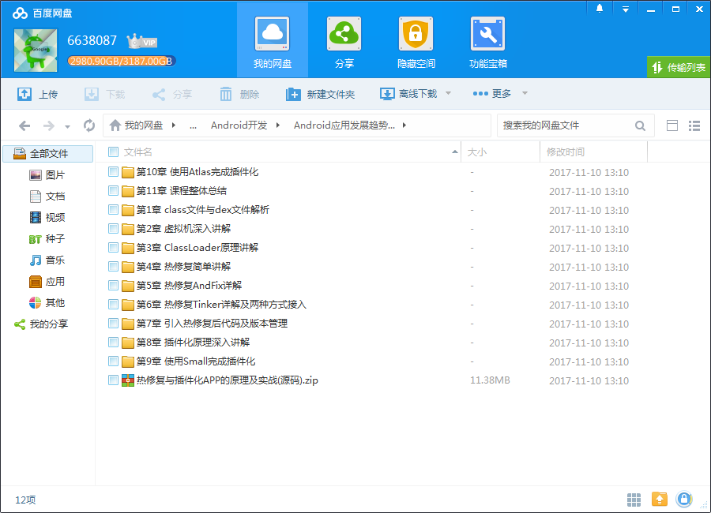

# Android应用发展趋势必备武器 热修复与插件化

## 课程介绍

2017年，Android开发热门技术讨论仍在继续，这是一门绝对稀缺的插件化与热修复综合学习的实战课程，涉及Android中如何加载apk中的类、资源，解耦业务代码，插件化自己的App，在线实时修复bug更换样式等，这些技术在不断的演进过程中被逐个攻破。

<!--more-->

## 课程章节

### 第1章 class文件与dex文件解析

本章通过从java最基本的class文件与android最基本的dex文件进行对比，并不借助IDE去生成及执行class与dex文件，通过讲解class与dex的手动生成，执行， 格式对比，让学生明白二者的相同与不同。

### 第2章 虚拟机深入讲解

本章主要介绍jvm，dvm，art。通过对这三个虚拟机的介绍让学生明白，android虚拟机是一步步从dvm发展到今天的art，以及在发展的过程中，android操作系统对虚拟机主要做了那些方面的优化并详细的讲解了java虚拟机在结构，编译流程，类加载以及内存管理等方面的知识。...

### 第3章 ClassLoader原理讲解

本章主要通过对android中的ClassLoader进行介绍和对比，说明android中类去如何被加载到虚拟机中的，通过带领同学们阅读源码，更能掌握ClassLoader的核心思想，本章是动态加载这一章最核心的内容，ClassLoader也是我们能免热修复和插件化的理论基础。...

### 第4章 热修复简单讲解

通过介绍市面上比较流行的热修复框架并进行对比，教会同学们在面对多种技术方案的时候，如何选出最适合自己的方案，以及我们为什么最终选择AndFix与Tinker.

### 第5章 热修复AndFix详解

通过讲解阿里开源的AndFix的原理和执行流程，为同学们讲清楚AndFix是如何去在线修复bug的，在了解了AndFix的修复原理后，我们创建一个工程并完成对AndFix的集成和bug修复。

### 第6章 热修复Tinker详解及两种方式接入

本章通过对Tinker的原理和执行流程的介绍让同们学了解Tinker的原理并教会同学如使用命令行的方式去接入Tinker并修复bug。并且通过在gradle中集成tinker，详解了tinker的主要要配置参数，让学生掌握如何通过gradle去更加方便的集成tinker并使用。...

### 第7章 引入热修复后代码及版本管理

本章通过介绍在项目中引入热修复技术后，如何管理我们的代码及版本发布，让同学们了解，在企业中引入热修复后，我们去如何合理的管理我们的代码。

### 第8章 插件化原理深入讲解

通过本章的学习，让同学们了解什么是插件化，插件化与组件化两种思想的区别，以及插件化的原理和难点。

### 第9章 使用Small完成插件化

本章通过对Small框架的介绍，让同学们能够了解small,以及如何通过Small完成app的插件化。

### 第10章 使用Atlas完成插件化

本章通过对Atlas框架的介绍，让同学们能够了解Atlas,以及如何通过Atlas完成app的插件化。

### 第11章 课程整体总结

通过本章总结本次实战课程所能学到所有知识点，技术经及同学们学了以后的收获，让大家了解本次实战课程的核心价值。

## 更多教程

教程不断整理更新中，以上截图仅供参考，如需了解更多视频教程的详细信息请到如下地址查看：
[教程分类说明](https://itvedios.github.io/categories/)：<https://itvedios.github.io/categories/>

## 获取方式

[关于教程、获取方式、温馨提示](https://itvedios.github.io/about/)
