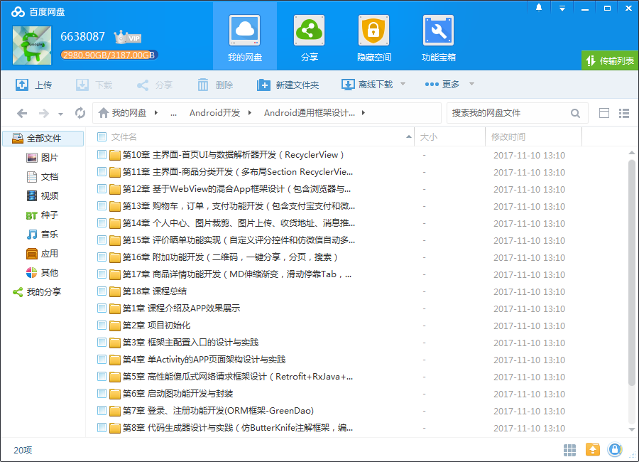
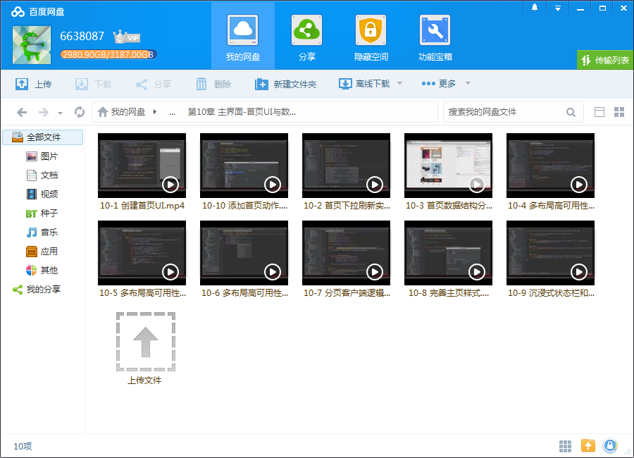
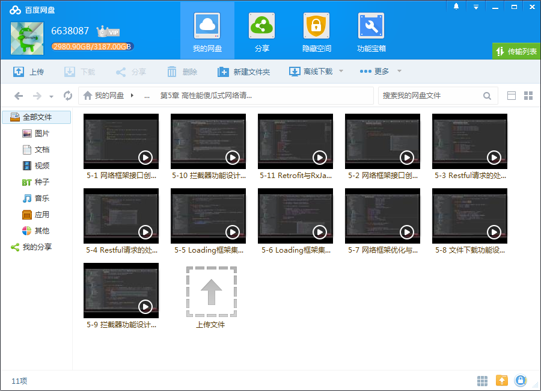

# Android 通用框架设计与完整电商 APP开发

## 课程介绍

全程带你从零设计通用的项目框架，并通过框架快速开发一个完整电商App验证和完善框架的复用性与灵活性等，综合提高你的项目框架设计能力和业务功能的快速实现能力,让你的开发工作更轻松！

<!--more-->

## 课程章节

### 第1章 课程介绍及APP效果展示

本章概述了本课程大家能学到什么，老师如何讲解，为什么这么讲解，并介绍了框架的整体架构设计与模块分解，最后展示了用自己设计的框架开发出来的完整电商APP的效果图（服务端API快速搭建教程：http://www.imooc.com/article/19001）...

### 第2章 项目初始化

本章将从零搭建一个空项目，实践项目搭建的过程，并额外教大家搭建一个基于Go语言的Web版Git服务器，实现代码托管的自举。（服务端API快速搭建教程：http://www.imooc.com/article/19001）

### 第3章 框架主配置入口的设计与实践

本章将带大家确定框架的配置加载形式和基本结构，并为框架封装一键配置字体图标功能，然后验证基础框架的正确性和简易性。

### 第4章 单Activity的APP页面架构设计与实践

本章将开辟新思路，设计单Activity 的App页面呈现架构，搭建起方便易用且利于扩展的单Activity基础骨架，让应用占用更小的内存，切换更加丝滑。

### 第5章 高性能傻瓜式网络请求框架设计（Retrofit+RxJava+Glide）

本章将以Retrofit为基础，借助建造者设计模式的变种，设计高性能，高扩展性和可用性的，符合restful接口设计规范的网络请求框架，实现全程链式调用，配置自由，使用无脑，并支持主流HTTP请求和文件的上传下载等功能，最后拓展Retrofit与RxJava的整合，让网络框架支持响应式编程。...

### 第6章 启动图功能开发与封装

本章将带大家实现两种启动图功能：倒计时渐变消失型和滑动型。

### 第7章 登录、注册功能开发(ORM框架-GreenDao)

本章将开始登录注册功能的开发，包括梳理用户登录注册的逻辑与服务器之间的交互，并引入当下流行的高性能ORM数据库框架-GreenDao进行数据持久化实战，同时带给大家一些可视化调试的小技巧。

### 第8章 代码生成器设计与实践（仿ButterKnife注解框架，编译期生成代码）

本章将以ButterKnife作为蓝本，设计与实现一套自己的代码生成器，并通过annotationProcessor生成自己指定规则的代码，绕过微信wxapi包名和类名的限制，自由调用微信登录代码。同时，梳理微信登录业务逻辑，并实现微信登录功能。

### 第9章 主界面-通用底部导航设计与一键式封装

本章将带大家设计项目主界面的基本结构，并封装极简的BottomBar，实现一键式添加子项目和内容，最后带大家实现电商APP的主界面整体架构。

### 第10章 主界面-首页UI与数据解析器开发（RecyclerView）

本章将创建主界面-首页UI，实现下拉刷新，并分析电商首页数据结构，然后创建数据解析器。同时，打造多布局高可用性RecyclerView体系，让所有的基于RecyclerView的UI结构都简易化，标准化，和无脑使用化，让多变的业务代码变成简单的套用。...

### 第11章 主界面-商品分类开发（多布局Section RecyclerView）

本章将带大家完成主界面-商品分类的UI和数据解析，并实现多布局Section RecyclerView的编写。

### 第12章 基于WebView的混合App框架设计（包含浏览器与原生请求Cookie的处理）

本章将带大家构造一个自己的高可扩展性的混合App框架，实现高度模拟原生的Web跳转，并搭建与原生交互的一键式配置事件体系，让混合应用的JavaScript与Java的交互变得简单，清晰和一键式配置，最后拓展通过RxJava同步浏览器和原生请求Cookie的功能。...

### 第13章 购物车，订单，支付功能开发（包含支付宝支付和微信支付）

本章将带大家完成购物车UI的编写，对购物车内部选中，删除，清空以及结算的逻辑进行梳理，并梳理订单生成与第三方支付的逻辑，封装傻瓜式调用的支付工具并实现支付宝，微信的支付功能。

### 第14章 个人中心、图片裁剪、图片上传、收货地址、消息推送、权限管理等功能开发与一键式封装

本章带大家完成个人中心、图片裁剪、图片上传、收货地址、消息推送、权限管理，系统设置等功能的开发，同时封装极易使用的相机调用工具。梳理图片上传和更新逻辑，并实例示范。集成并调用极光推送，完成应用接收远程信息推送的功能。...

### 第15章 评价晒单功能实现（自定义评分控件和仿微信自动多图选择控件）

本章将从零开始带大家定制自己的自定义View，分别完成评价晒单中评分布局和仿微信自动多图选择和删除控件，让大家在自定义View的道路上更上一层楼。

### 第16章 附加功能开发（二维码，一键分享，分页，搜索）

本章将带大家完成一些周边的小功能，麻雀虽小五脏俱全，将高性能二维码扫描方案和一键分享方案集成到框架中，方便以后一键调用。

### 第17章 商品详情功能开发（MD伸缩渐变，滑动停靠Tab，商品加入购物车飞入动画）

本章将带大家设计商品详情UI架构，实现MD风格伸缩渐变效果，滑动停靠Tab，商品加入购物车的飞入动画效果，并最终完善商品详情功能。

### 第18章 课程总结

本章将对本课程的重难点进行总结，尤其是框架设计的思想，方法，经验，技巧以及业务开发过程中如何更好的完善与验证框架的灵活性，易用性等。

## 更多教程

教程不断整理更新中，以上截图仅供参考，如需了解更多视频教程的详细信息请到如下地址查看：
[教程分类说明](https://itvedios.github.io/categories/)：<https://itvedios.github.io/categories/>

## 获取方式

[关于教程、获取方式、温馨提示](https://itvedios.github.io/about/)
