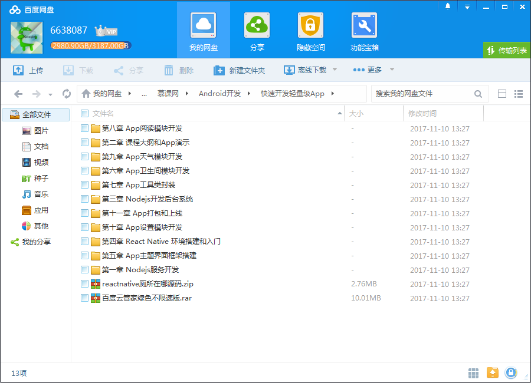
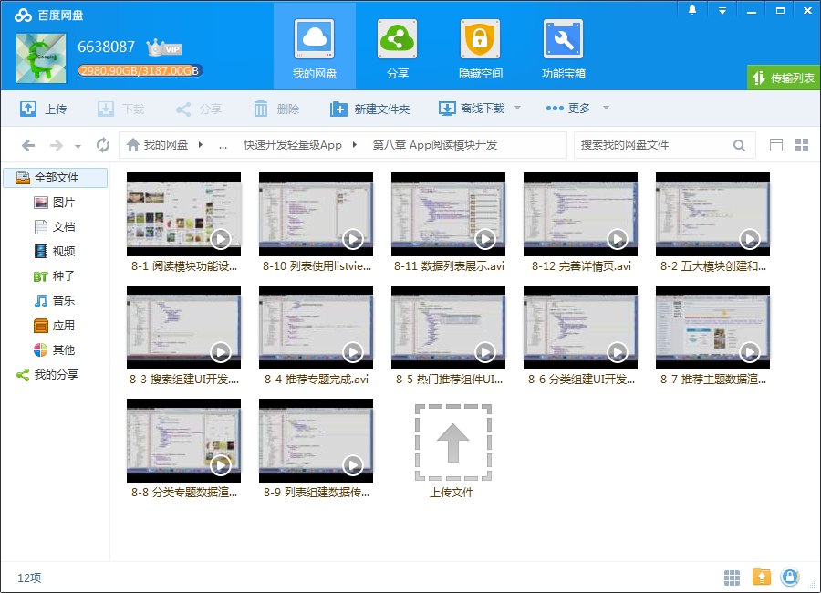
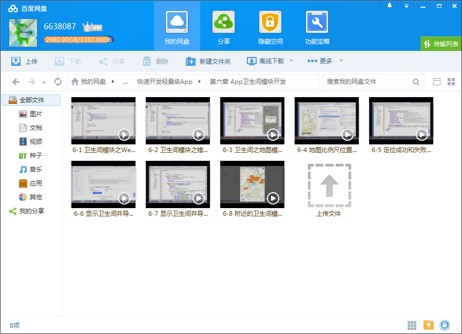

# 快速开发轻量级App

## 课程介绍

前端React Native，后台Node.js，用轻量级架构开发一款直接在AppStore上线的App，只需一周时间！

## 课程章节

### 第1章 课程大纲和App演示

介绍整个课程的内容、业务架构、技术选型以及App的功能演示。

### 第2章 Node.js服务开发

介绍了Node.js环境搭建、JSON数据文件的读取以及开发了基础的服务接口。该接口主要提供客户端（含Native端和PC web端）调用，用于数据展示和数据存储。

### 第3章 Node.js开发后台系统

讲解了通过调用第二章的接口，开发简易的后台CMS系统。该CMS系统主要用于配置页面数据和存储列表数据。

### 第4章 React Native环境搭建和入门

主要讲解React Native的环境搭建、项目运行的注意事项以及生命周期的简单介绍。通过该章，可以简单快速的了解下React Native的基础知识。

### 第5章 App主体界面框架搭建

第五章是App开发的开端，是App开发的第一步。本章主要介绍搭建App整体的UI框架和实现主体页面的组件化。

### 第6章 App 卫生间模块开发

介绍了卫生间模块开发。整个功能的核心是使用高德地图JS-API，例如搜索附近2km以内的卫生间以及展示卫生间的基础信息。同时为了方便用户使用App，还开发了路径导航功能。

### 第7章 App 工具类封装

不论是客户端还是服务端，工具类的封装是十分必要的。因此针对该应用封装了工具类，方便其他组件复用。

### 第8章 App 阅读模块开发

阅读模块是整个App的重点，主要包括整体功能以及各模块设计。例如推荐专题的开发、列表数据的渲染、分类组件的开发等等。

### 第9章 App 天气模块开发

调用了高德地图开放平台天气接口，向用户展示当前天气的信息，例如温度、风向等。

### 第10章 App 设置模块开发

主要提供了App的使用帮助、功能介绍、使用条款等信息。

### 第11章 App 打包和上线

介绍了jsbundle 打包和优化加载、现有App的集成以及整体打包上线。

## 更多教程

教程不断整理更新中，以上截图仅供参考，如需了解更多视频教程的详细信息请到如下地址查看：
[教程分类说明](https://itvedios.github.io/categories/)：<https://itvedios.github.io/categories/>

## 获取方式

[关于教程、获取方式、温馨提示](https://itvedios.github.io/about/)
