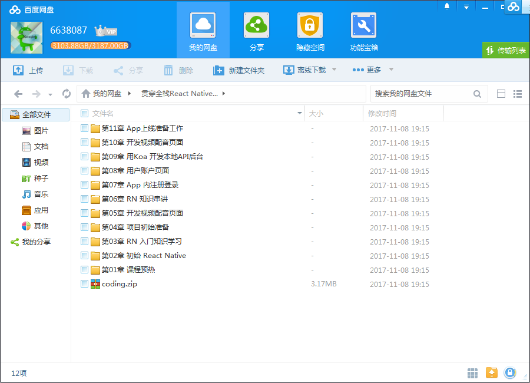
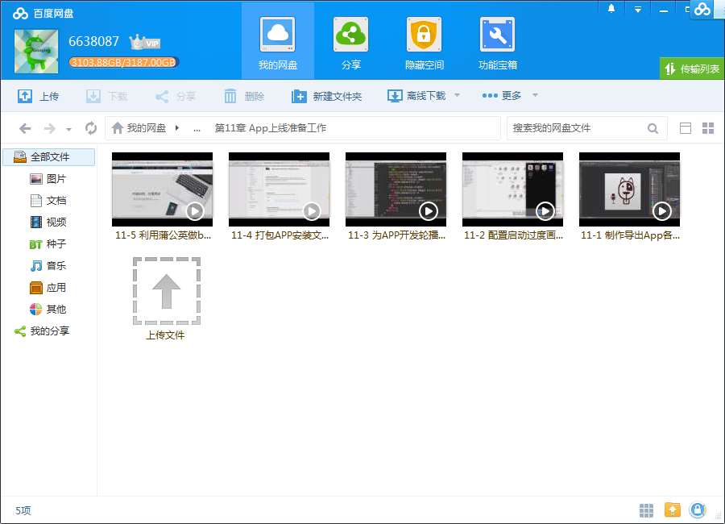
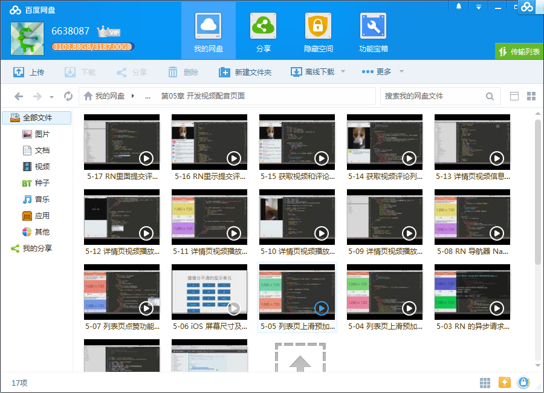
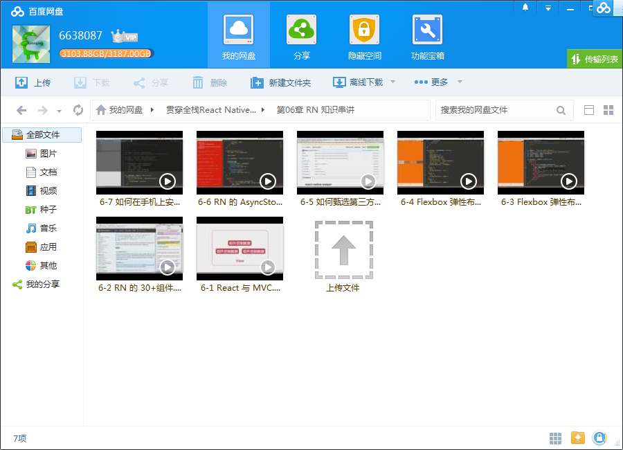

# 贯穿全栈React Native开发App

## 课程介绍

React Native版本升级，最新技能领先学习！这是一门颇受创业公司追捧的技术，一站式学习、掌握全栈技术，通过React Native 和 Node.js 前后端的配合，实现一个完整的跨前后端App项目，让你快速成为企业抢手人才，拥有跨栈跨端独立开发的能力。

<!--more-->

## 课程章节

### 第1章 课程预热

React 与 React Native的区别，为什么学习 React Native。

### 第2章 初识 React Native

快速搭建一个 React Native，了解 RN 的项目代码结构。

### 第3章 RN 入门知识学习

学习React 的组件概念，ES5/ES6 两种组件形态，父子组件通信以及组件生命周期。

### 第4章 升级 React Native 重要补录

这一章节是讲师针对课程上线以来，学生的常见问答，讲师做了一些总结补充视频。

### 第5章 项目初始准备

作为实战编程的上手篇，需要又快又猛的串联起来前后端，首先评审课程要实现的 App 视觉效果，形成项目推进的思路，制定 App 开发计划，然后搭建项目原型框架，开发 App 首页视图结构，同时利用 Rap 服务来模拟无后台的 HTTP API 接口，以及 Mockjs 加工生成伪数据。...

### 第6章 开发视频配音页面

开发 App 的核心业务功能 – 视频配音页面，学习在 RN 中选取本地的视频文件，上传到七牛，控制录音过程，上传录音到云空间，同时在后台了解如何在 Koa 中抽象中间件，以及利用 Mongoose来建立各种对应的视频，音频数据模型，存储视频和音频并且封装回调的请求为 Promise ，通过各种异步的过程来检查，最终合并...

### 第7章 RN 知识进阶串讲

以第五章为基础，来拔高技能点升级技能树，学习 Flexbox 的各种布局知识，批量了解 RN 的30 多个组件的功能和基本使用方式，演示如何使用 RN 的异步存储模块，并且了解如何甄选生态圈里面的第三方组件，最终研究下如何把本地的 RN 项目安装到手机里面运行。...

### 第8章 App 内注册登录

精讲在 RN 里面实现注册登录页面，如何发出注册请求，以验证码的方式实现登录过程，如何管理应用中的登录状态；

### 第9章 用户账户页面

精讲在 RN 里面调用本地的相机以及选取相册的照片，构建 FormData 来 XHR 异步上传图片，监控图片上传进度，以及用户的基本资料的编辑和保存，以及用户的退出登录功能。

### 第10章 用 Koa 开发本地 API 后台

基于前八章构建的 App 原型，首先安装 MongoDB 数据库，利用 Koa 框架搭建 Nodejs 后台项目，配置接入 MongoDB 数据库，为 App 提供各种 API 接口，比如在后台发送短信验证码，同时了解使用 DHC 插件快速验证接口正确性，最后在后台实现图床的签名，异步返会给 App 作为票据上传到 Cloudinary 或者 七...

### 第11章 开发视频配音页面

开发 App 的核心业务功能 – 视频配音页面，学习在 RN 中选取本地的视频文件，上传到七牛，控制录音过程，上传录音到云空间，同时在后台了解如何在 Koa 中抽象中间件，以及利用 Mongoose来 建立各种对应的视频，音频数据模型，存储视频和音频并且封装回调的请求为 Promise ，通过各种异步的过程来检查，最终...

### 第12章 App 上线准备工作

在 App 初步开发结束后，各种上线前的准备工作，比如制作导出不同尺寸的应用图标，启动画面，介绍 App 的轮播图，以及打包编译和导出用来内测的安装程序；

### 第13章 二期课程--初识 Redux 框架

初识 Redux 框架，React 蛋疼的数据通信，理解 Redux 的工作原理和基本用法。

### 第14章 二期课程--React Native 升级到 0.42.3

获取 1 期源码进行升级降级。

### 第15章 二期课程--兼容开发 Android App

兼容开发 Android App

## 更多教程

教程不断整理更新中，以上截图仅供参考，如需了解更多视频教程的详细信息请到如下地址查看：

[教程分类说明](https://itvedios.github.io/categories/)：<https://itvedios.github.io/categories/>

## 获取方式

[关于教程、获取方式、温馨提示](https://itvedios.github.io/about/)
