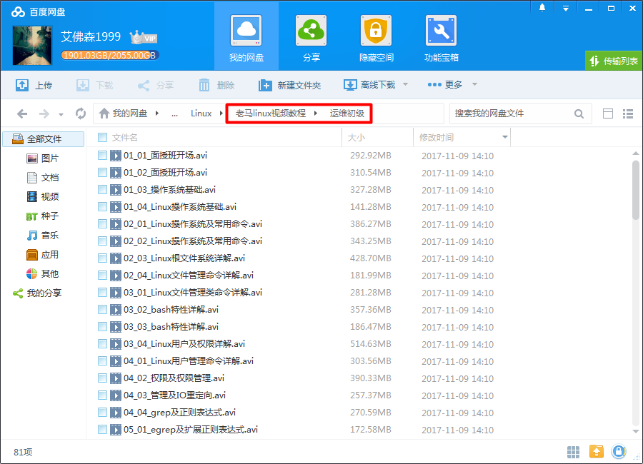
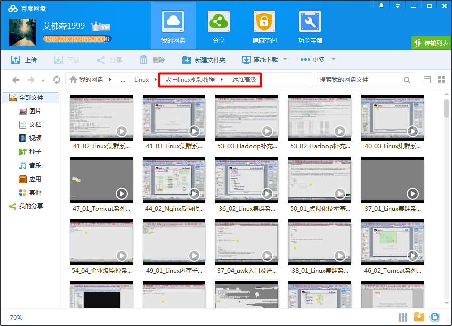
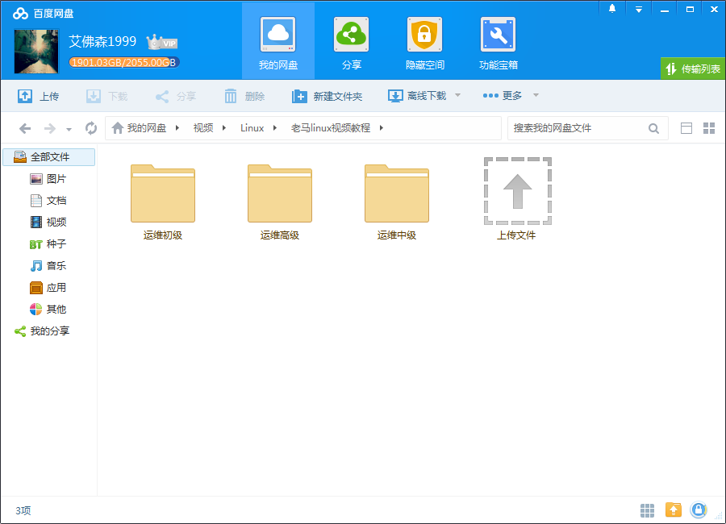

## 课程介绍

## 更多教程

教程不断整理更新中，以上截图仅供参考，如需了解更多视频教程的详细信息请到如下地址查看：

[教程分类说明](https://itvedios.github.io/categories/)：<https://itvedios.github.io/categories/>

## 获取方式

[关于教程、获取方式、温馨提示](https://itvedios.github.io/about/)
