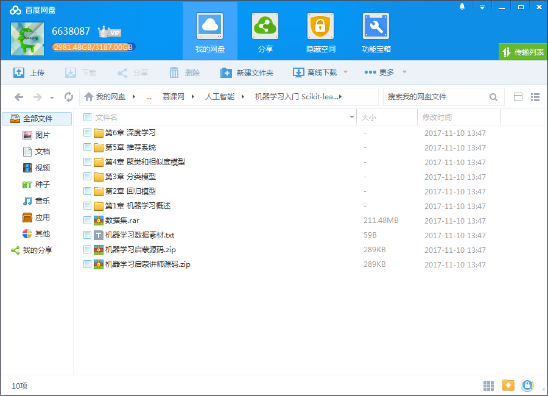
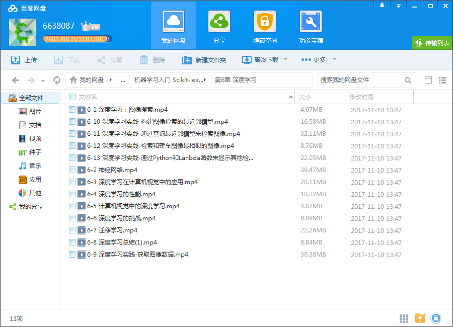

## 课程介绍

【课程全新升级】如果说现在是编程的时代，那下一个时代就是机器学习的时代，即便你没有超前于时代，也不能被时代所抛弃，所以，你至少应该入门一下机器学习

## 课程章节

### 第1章 机器学习概述

本章讲述了机器学习的基本概念，本门课的内容，以及在本门课中使用的一些工具安装方法和基本使用方法。

### 第2章 回归模型—理论

本章讲述了回归模型的基本原理和算法，并结合回归介绍了交叉验证的方法。

### 第3章 回归模型—房价预测进阶案例

通过一个预测房价的实际例子来展示了如何实际的构建和应用回归模型。

### 第4章 分类模型—理论

本章讲述了分类模型的基本原理和算法，并介绍了一些评估分类器好坏的方法。

### 第5章 分类模型—情感分析进阶案例

通过一个情感分析的实际例子来展示了如何实际的构建和应用分类模型。

### 第6章 聚类和相似度模型—理论

本章讲述了聚类和基于相似度模型的基本原理和算法，并且介绍了文本分析中最重要的一种表示方式TF-IDF。

### 第7章 聚类和相似度模型—维基百科人物相似度案例

通过一个维基百科中的文本分析实际例子来展示了如何实际的构建和应用聚类和相似度模型。

### 第8章 推荐系统—理论

本章介绍了推荐系统的基本原理和方法，具体介绍常用的利用协同过滤和矩阵分解来构建推荐系统的方法，并且还介绍了如何来处理冷启动的情况。

### 第9章 推荐系统—构建推荐系统案例

通过一个小型的基于用户电影评分推荐系统的实践案例结束课程

### 第10章 深度学习—理论

本章主要对深度学习进行了一个入门的介绍，讲述了在图像检索中运用到的深度学习理论和算法，然后引申到利用深度特征的迁移学习。

### 第11章 神经网络—案例部分

利用神经网络来计算XOR

### 第12章 结尾章

本章是本门课程的最后一章，主要讲述了如何部署机器学习服务，和机器学习以后的发展方向，还有一些机遇和挑战。

## 更多教程

教程不断整理更新中，以上截图仅供参考，如需了解更多视频教程的详细信息请到如下地址查看：

[教程分类说明](https://itvedios.github.io/categories/)：<https://itvedios.github.io/categories/>

## 获取方式

[关于教程、获取方式、温馨提示](https://itvedios.github.io/about/)
