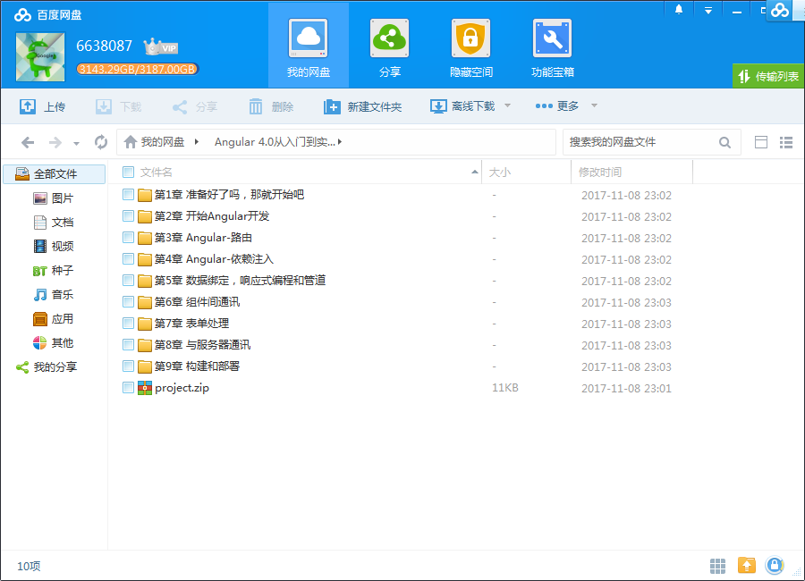
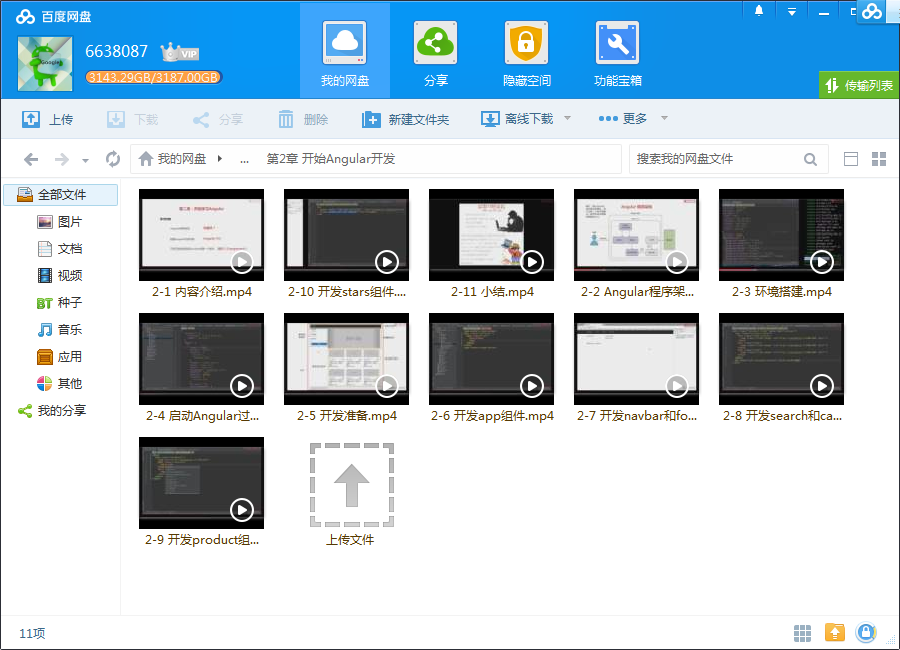
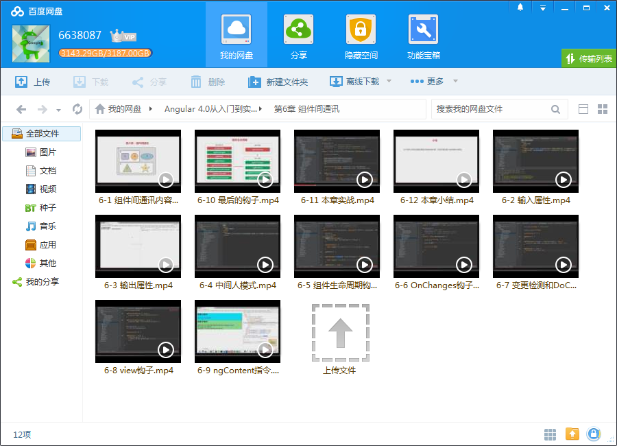
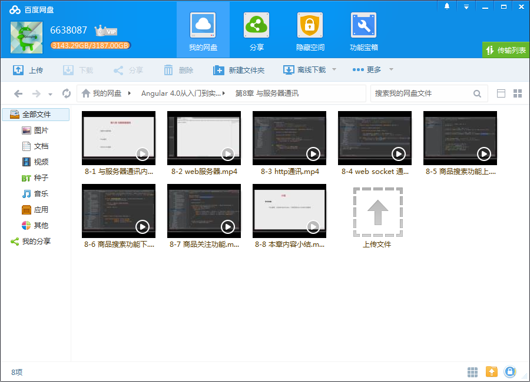

# Angular 4.0从入门到实战 打造股票管理网站

## 课程介绍

课程紧跟Angular更新迭代，带你尝鲜最近发布的Angular4.0版本。

<!--more-->

## 课程章节

### 第1章 准备好了吗，那就开始吧！

在这一章里，我们首先会对整个课程的内容做一个简要的介绍，包括章节的安排，实战案例的介绍以及前置知识的介绍等内容。然后我们会从一个比较高的视角对angularJS和angular的架构做一个介绍和比较，使你对angular有一个初步的印象。...

### 第2章 开始Angular开发

我们会开始开发一个简单的angular应用。首先你会学习标准的angular程序的架构，然后会学习如何搭建一个angular的开发环境，在这个环境中创建项目，编写angular的组件，并最终运行一个angular应用。在这一章的最后，我们会编写股票管理的第一个版本，用这一章学到的知识编写一个组件化的主页出来。...

### 第3章 Angular-路由

主要讲解angular路由相关的知识。angular的路由提供了一个灵活的方式来在单页应用中进行导航，你将会学习如何在父组件和子组件配置路由，在从一个路由导航到另一个路由时如何传递数据，以及子路由、重定向路由、辅助路由、路由守卫等与路由相关的知识，在这一章的最后，我们会重构之前的股票管理应用，把它重新封装为一些新...

### 第4章 Angular-依赖注入

你将会学习关于依赖注入设计模式的知识以及angular是如何实现依赖注入模式的。angular开发中最重要的问题就是如何开发可重用的组件，而依赖注入则是编写可重用组件的重要技术手段之一。我们将会详细讲解angular的提供器和注入器的相关知识。在新的股票管理应用中，我们会使用依赖注入来解耦组件和服务间的依赖。使组件的重...

### 第5章 数据绑定，响应式编程和管道

首先会详细的介绍angular中各种数据绑定的方式，然后会介绍响应式编程的基础知识，在angular中，我们会频繁的使用响应式编程来处理各种异步事件。在这一章中，我们还会介绍如何使用管道来格式化和过滤数据。在这一章的最后，我们会综合运用本章学到的知识，为我们的股票管理项目添加一个过滤功能。...

### 第6章 组件间通讯

主要是讲如何让组件之间以一种松耦合的方式来彼此通讯，我们会学习组件的输入输出属性，会学习一个新的模式：中间人模式，还会学习组件生命周期的相关知识，包括组件生命周期钩子以及angular的变更检测机制等内容，最后我们会使用本章的知识来开发一个高度可重用的星级评价组件。...

### 第7章 表单处理

主要介绍在angular中如何处理表单，我们会从最基础的html表单入手，首先我们会讨论纯html表单的不足之处，然后介绍angular的表单处理API是如何弥补这些不足的。我们会详细的介绍angular的两套表单处理API，一套叫做模板式表单，另一套叫做响应式表单，介绍它们各自的特性、优势和需要注意的地方。我们还会详细的学习如何使...

### 第8章 与服务器通讯

这一章讲解了一个angular客户端应用如何使用http协议和WebSocket协议与服务器进行通讯。首先我们会用nodejs和express框架创建一个简单web服务器。然后我们会介绍angular的Http服务，以及如何使用http服务来与服务通讯并响应式的处理服务器返回的数据。接着我们会进入这门课最难的一部分，我们会详细讲解WebSocket协议的特性...

### 第9章 构建和部署

我们会学习如何编译typescript写成的项目，将其构建为最终可发布的js代码，并将其发布到我们前一章编写的nodejs服务器上去。我们还会讨论angular的多环境支撑能力，学习如何用一套代码适应开发、测试、生产等多种不同的环境。...

### 第10章 课程总结

取经之路终于完成，这一章我们会回顾整门课中学到的知识，并对后面的进一步学习指出一些方向。

## 更多教程

教程不断整理更新中，以上截图仅供参考，如需了解更多视频教程的详细信息请到如下地址查看：

[教程分类说明](https://itvedios.github.io/categories/)：<https://itvedios.github.io/categories/>

## 获取方式

[关于教程、获取方式、温馨提示](https://itvedios.github.io/about/)
