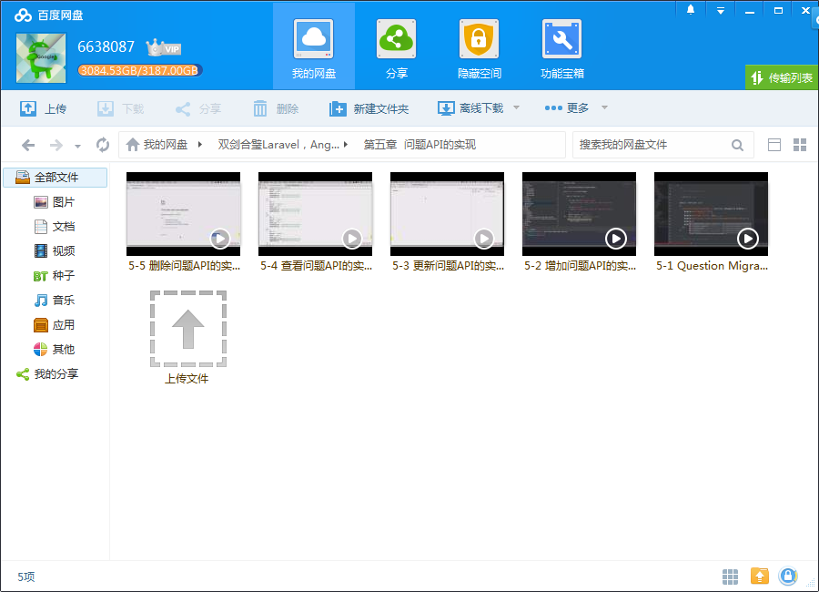
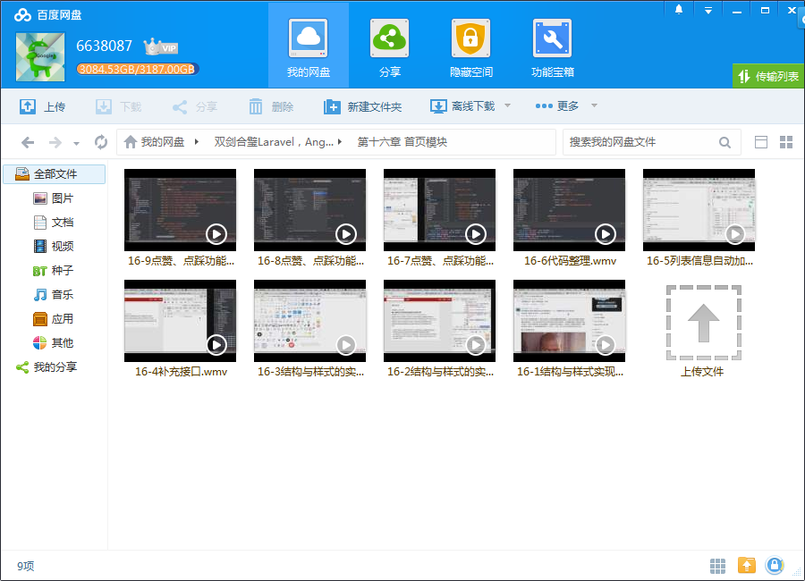
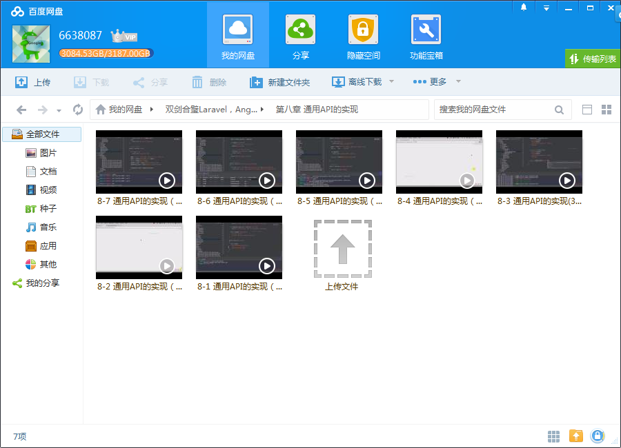

# Laravel和 Angular JS开发全栈知乎

## 课程介绍

前端AngularJS，后端Laravel，开发一个你自己的 “知乎”，特别适合这两门技术的初学者，让你获得技术和开发思维的双重提升。

<!--more-->

## 课程章节

### 第1章 课程介绍

介绍课程内容、背景和案例展示

### 第2章 了解Composer的安装laravel的部署

介绍Composer的作用以及使用它安装Laravel及其依赖的方式

### 第3章 Migration在本项目中的使用

什么是Migration？为什么需要Migration？怎么使用Migration？

### 第4章 用户API实现

介绍了如何实现用户注册及登录、Laravel的session机制、用户权限管理的实现原则

### 第5章 问题API的实现

介绍问题模块中最基础的增删改查API，数据验证及删除权限的限制

### 第6章 回答API的实现

介绍回答模块中最基础的增删改查API，数据验证及删除权限的限制

### 第7章 评论API的实现

介绍了评论模块中最基础的增删改查API，数据验证及删除权限的限制。评论与其他模型的关系更为复杂，此处会讲到Laravel中一对多关系

### 第8章 通用API的实现

讲解了当API调用到多个model，面对更复杂更综合的情况时如何规划接口。

### 第9章 后端总结

概括及总结实现后端的要点及难点、注意事项、以及强调API的设计原则。

### 第10章 前端的部署

前端依赖的安装和部署，如：Angular，ui-router

### 第11章 路由的建立

使用ui-router进行前端路由的规划

### 第12章 整体布局

对所有页面进行整体布局，以保证在不同页面中的布局标准统一。

### 第13章 注册模块

对注册页面进行布局，建立相应的服务与控制器，调用API并绑定数据

### 第14章 登录模块

对登录页面进行布局，建立登录页面相应的服务与控制器，调用登录页面API并绑定数据。

### 第15章 添加问题模块

对添加问题页面进行布局，建立添加问题模块相应的服务与控制器，调用添加问题模块API并绑定数据。

### 第16章 首页模块

对首页页面进行布局，建立首页模块相应的服务与控制器，调用首页模块API并绑定数据。

### 第17章 用户详情模块

用户详情页面进行布局，建立用户详情模块相应的服务与控制器，调用用户详情模块API并绑定数据。

### 第18章 问题详情模块

对问题详情模块页面进行布局，建立问题详情模块相应的服务与控制器，调用问题详情模块API并绑定数据。

### 第19章 回答模块

对回答模块页面进行布局，建立回答模块相应的服务与控制器，调用回答模块API并绑定数据。

### 第20章 评论模块

对评论模块页面进行布局，建立评论模块相应的服务与控制器，调用评论模块API并绑定数据。

### 第21章 问题修改模块

问题修改模块

## 更多教程

教程不断整理更新中，以上截图仅供参考，如需了解更多视频教程的详细信息请到如下地址查看：

[教程分类说明](https://itvedios.github.io/categories/)：<https://itvedios.github.io/categories/>

## 获取方式

[关于教程、获取方式、温馨提示](https://itvedios.github.io/about/)
