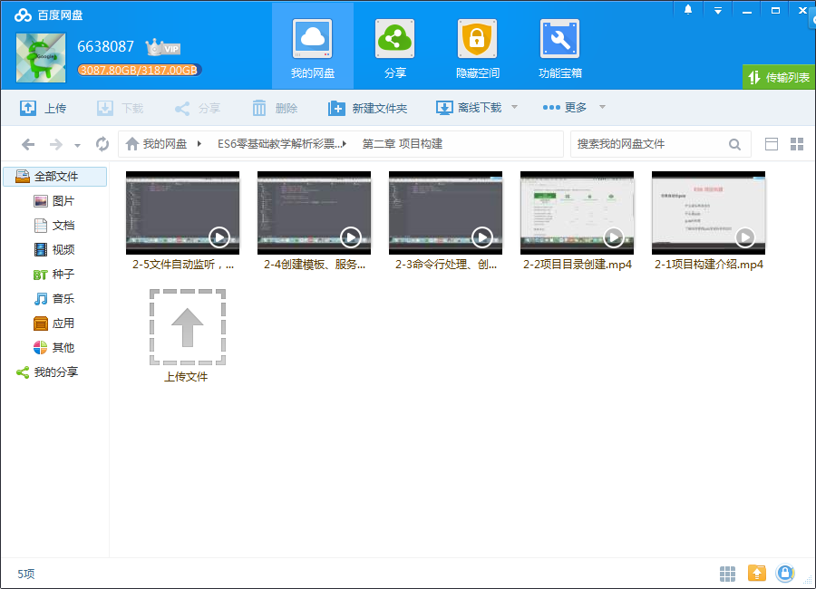

# ES6零基础教学 解析彩票项目

## 课程介绍

还在为ES5复杂难懂的语法而头疼？有了ES6我们不再烦恼，本课程会全面讲解ES6，结合ES5对比讲解ES6的特性，教你如何应用ES6开发项目，让你的代码更简洁清晰。

<!--more-->

## 课程章节

### 第1章 课程介绍

ES6作为最新的JavaScript核心语言标准，成为前端工程师必备的技能之一。本章首先介绍ES6的基本概念及历史背景让大家走近ES6，了解什么是ES6以及学习ES6的必要性；然后会为大家简明扼要的讲述ES6带来了哪些新特性以及这些特性有什么作用。...

### 第2章 项目构建

工欲善其事必先利其器，本章重点讲述如何使用Gulp、Babel、Webpack做好ES6工程的构建；通过手把手编写gulp脚本完成ES6的自动编译、打包、文件监听、浏览器热更新、模板自动更新、服务热启动等，在本章大家不仅可以学到gulp、babel、webpack相关知识，还可以学习到工程架构思想及做法。...

### 第3章 es6语法

本章通过语法介绍、实例演示、实用技巧三个维度来讲解ES6所有新特性，包括Let和Const、解构赋值、数组扩展、字符串扩展、函数扩展、正则扩展、数值扩展、对象扩展、类与对象、Set和Map数据结构、Symbol、Proxy和Reflect、Generator(async\wait)、遍历接口、Decorator修饰器、模块化，在本章可以系统的学习ES6相关的所有知识...

### 第4章 项目实战

本章重点是运用ES6语法去构建实际的项目（彩票电商），通过需求分析、项目架构思考、模块划分、服务端程序部署、前端代码编写、联调测试几个步骤，真实还原实际业务开发流程。大家在本章可以学习如何转变开发思维及设计代码的能力，举一反思将ES6强大的特性运用到实际业务中去...

### 第5章 课程总结

本章主要回顾ES6的知识点，帮大家梳理重点和难点；学会ES6语法不难，活学活用到项目才是关键，本章也会温习上个章节实战的思路和技巧，给大家提供一些学好ES6的建议和方法

## 更多教程

教程不断整理更新中，以上截图仅供参考，如需了解更多视频教程的详细信息请到如下地址查看：

[教程分类说明](https://itvedios.github.io/categories/)：<https://itvedios.github.io/categories/>

## 获取方式

[关于教程、获取方式、温馨提示](https://itvedios.github.io/about/)
