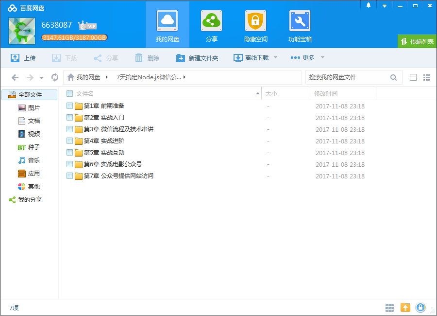
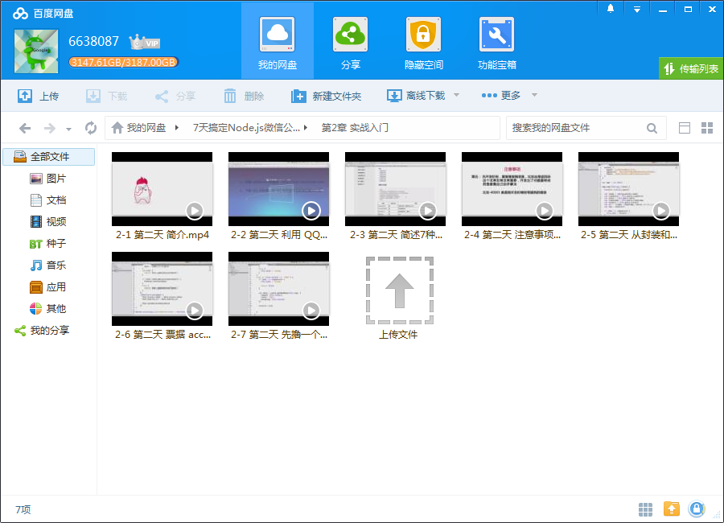
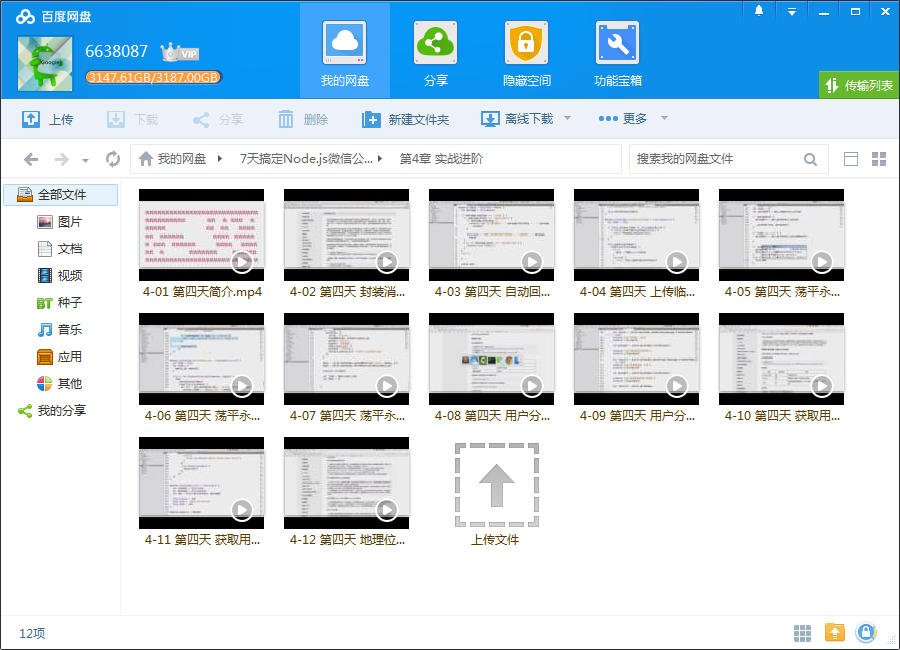
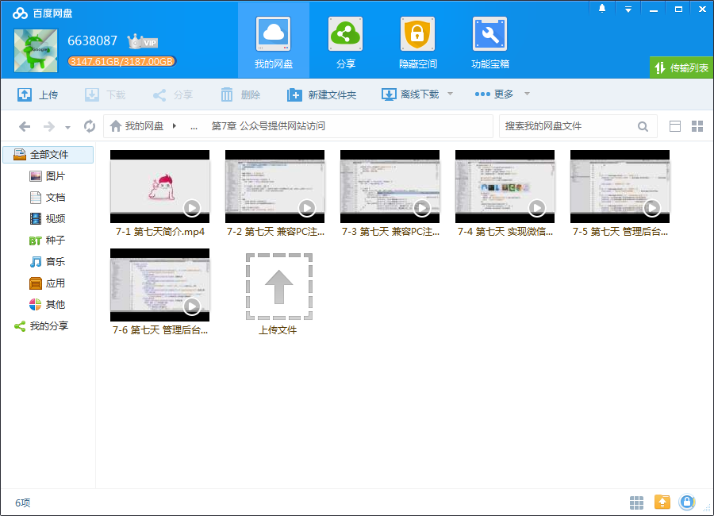

# 7天搞定Node.js微信公众号

## 课程介绍

微信公众号已经1000多万个了，即使不为市场，为自己也应该学会开发它。

<!--more-->

## 课程章节

### 第1章 前期准备

让我们和老师一起做些准备工作，搭建好开发环境，了解微信号的分类和功能，最后写段代码实现加密认证逻辑。

### 第2章 实战入门

理解微信中票据的作用，利用微信中消息与回复的功能，编写一个简易的“回复机器人”效果。

### 第3章 微信流程及技术串讲

本章节会对课程中所需要的ES6中的新技术点进行一次串讲，包括Promise 如何使用，Generator 生成器，及 Koa 和 Express 中间件。

### 第4章 实战进阶

这一天的工作是将微信提供的重要接口，一个一个串下来，尤其是实现素材接口的调用。

### 第5章 实战互动

这一天的课程会非常有趣味性，也非常实用，包括：微信菜单、二维码及JS-SDK。

### 第6章 实战电影公众号

这一天我们要对一个电影网站的老项目进行框架层面的重构：Express改Koa。这对于一线的小白工程师将更具参考价值。

### 第7章 公众号提供网站访问

这一天我们将对网站端做适配，从而让这个基于koa框架的项目也能完全支撑 Express 框架的业务逻辑。

## 更多教程

教程不断整理更新中，以上截图仅供参考，如需了解更多视频教程的详细信息请到如下地址查看：

[教程分类说明](https://itvedios.github.io/categories/)：<https://itvedios.github.io/categories/>

## 获取方式

[关于教程、获取方式、温馨提示](https://itvedios.github.io/about/)
