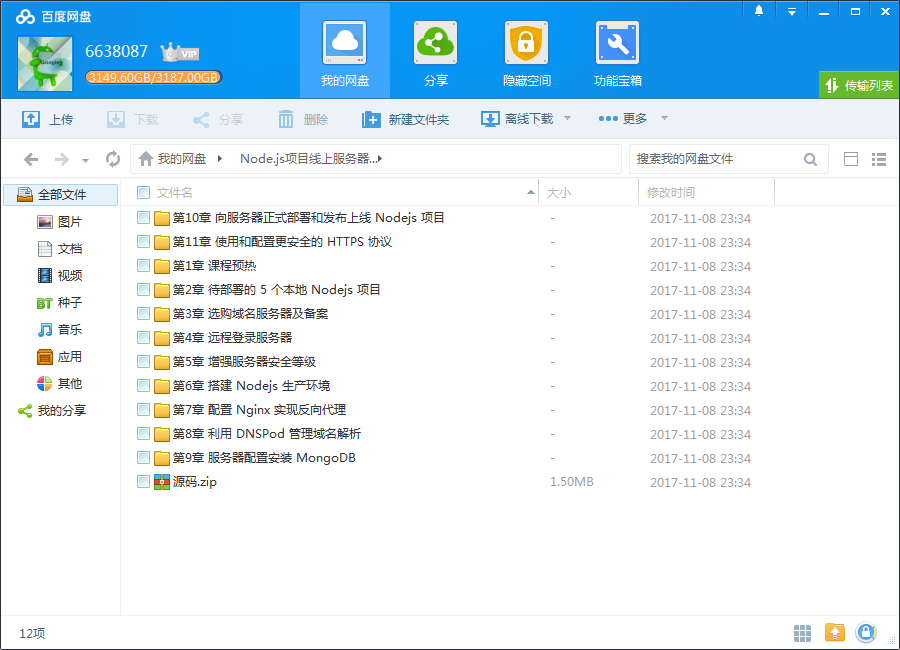

# Node.js项目线上服务器部署与发布

## 课程介绍

项目测试通过，到了上线部署阶段，你该怎么做？本课程将通过5个不同类型的 Node.js 项目实例，从0部署系统讲解，最终让您掌握整个项目部署发布作业流程。

<!--more-->

## 课程章节

### 第1章 课程预热

对整个部署思路进行全流程介绍，通过 5 个不同类型项目，来演示从本地的仓库到最终线上稳定运行的整个项目部署发布流程，来帮助始终编程在一线的前端或者后端工程师，甚至是有 Coding 能力的产品经理，从操作流程和架构形态上，掌握从零开始的项目上线环节，掌握这关键一步，跨过去前端到后端，本地到线上，开发到生产...

### 第2章 待部署的 5 个本地 Nodejs 项目

分别介绍五个技术架构和产品形态的项目背景，一个 Nodejs 静态网站，普通的带数据库电影网站，手机 App 场景下的后端项目如何通过服务器跟应用进行数据通信交互的场景，小程序的运行平台，基于此平台下需要提供的 API 服务如何部署，公众号的前端后端及消息机制下搭建的功能形态，部署需要注意的事项，以及一个生动有...

### 第3章 选购域名服务器及备案

各种方法论和躲不过去的流程，介绍哪些域名服务商相对比较靠谱，选取域名可以遵从哪些规则，选择服务器的经验和方法，以阿里云主机为例演示选择配置和购买流程，域名备案需要填写哪些信息，递交哪些材料，申请流程是怎样的，产品能生存的软环境是每一个产品开发人员必须了然于胸的硬经验。...

### 第4章 远程登录服务器

从本地命令行终端 iTerm2 或者 Putty 连接并登录到外网的服务器，配置用以发布和管理应用的用户，取代 root 超级管理员执行环境，配置更安全的私钥加密无密码验证登录。

### 第5章 增强服务器安全等级

修改服务修改服务器的 22 端口，取消密码登录，增大服务器的破解难度，配置 IPTables 防火墙规则，通过 Fail2Ban 增强服务器的防御动作，提高服务器的安全系数，对整个线上服务器进行各种安全防护的增强器的 22 端口，取消密码登录，增大服务器的破解难度。...

### 第6章 搭建 Nodejs 生产环境

Ubunbu 服务器上通过 nvm 安装及管理 Nodejs 版本，以及 nvm 全局模块使用中可能遇到的问题解决思路，安装 PM2 并简单介绍 PM2 的基本使用和它生产环境中的角色。

### 第7章 配置 Nginx 实现反向代理

安装并配置 Nginx 的 upstream，端口的映射转发给后台的 Nodejs 服务，实现服务的识别和转发。

### 第8章 利用 DNSPod 管理域名解析

更改域名的 DNS 根服务器，为域名指定一个新的解析平台，统一管理；学习不同的解析类型，增加多条解析规则，为不同类型的资源和服务配置 A 记录和 CNAME。

### 第9章 服务器配置安装 MongoDB

在 Ubuntu 14.04 上加速安装 MongoDB 特定版本，学习使用 mongodump mongorestore mongoexport mongoimport 来实现单表单库导入导出，从线上远程管理配置 Mongodb 的读写和备份权限，实现生产环境下垮服务器之间的数据迁移流程，结合系统 crontab bash 脚本 mongodump 和备份角色实现定时备份，通过 Node...

### 第10章 向服务器正式部署和发布上线 Nodejs 项目

利用免费 Git 私有仓库平台管理项目源码版本，从本地及服务器的 PM2 来初始化应用的线上目录，一句命令来实现与服务器通信实现自动获取代码自动重启，分别演示 5 个项目的部署上线流程，演示带数据库的 API 型应用上线流程及微信后台 URL 配置。...

### 第11章 使用和配置更安全的 HTTPS 协议

不同的 SSL 证书类型及安全等级，利用免费提供 SSL 的平台申请及服务器上通过 Nginx 来配置证书验证模块，最后总结，我们学习和理解了一个真实的本地 Nodejs 项目，是如何被部署上线的，一台真实的服务器生产环境是如何被配置起来的，前端和后端的最后一个环节是如何通过域名和服务器串联起来的，以及必要的安全事...

## 更多教程

教程不断整理更新中，以上截图仅供参考，如需了解更多视频教程的详细信息请到如下地址查看：

[教程分类说明](https://itvedios.github.io/categories/)：<https://itvedios.github.io/categories/>

## 获取方式

[关于教程、获取方式、温馨提示](https://itvedios.github.io/about/)
