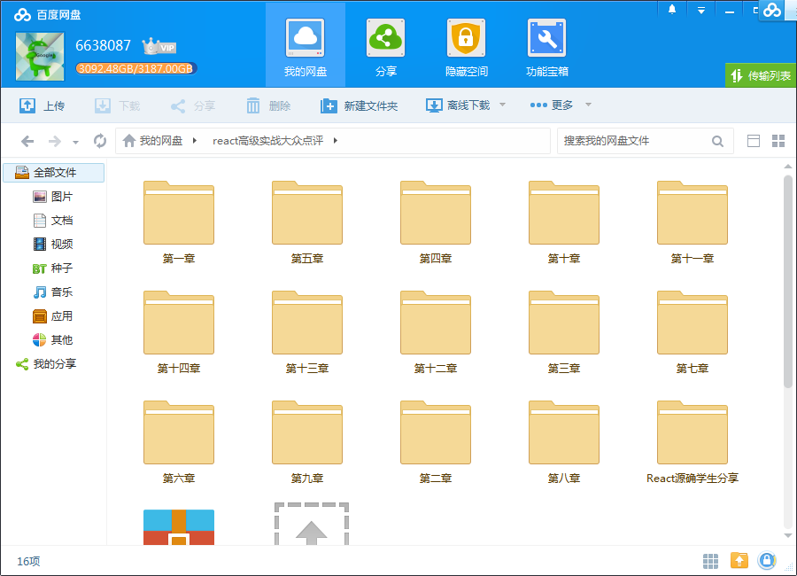
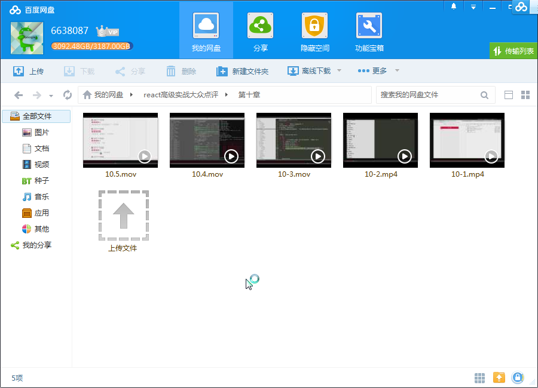
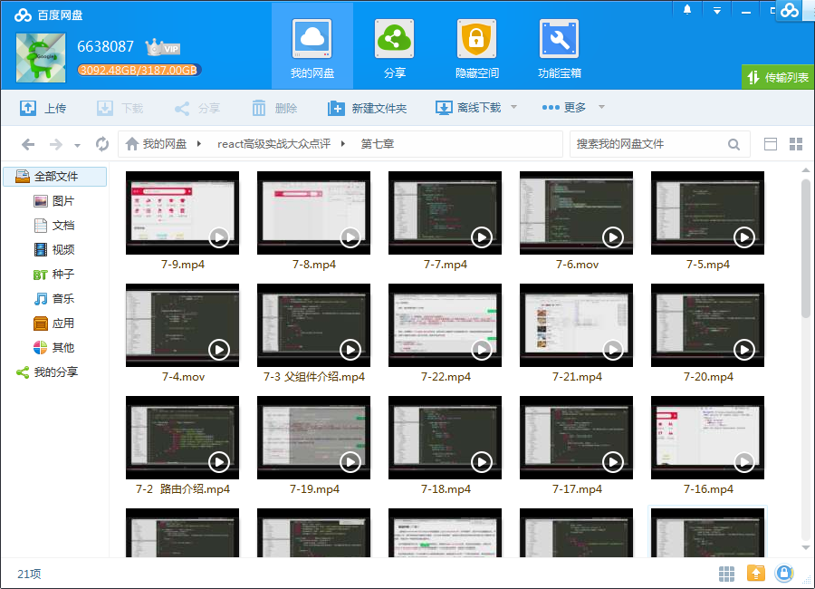
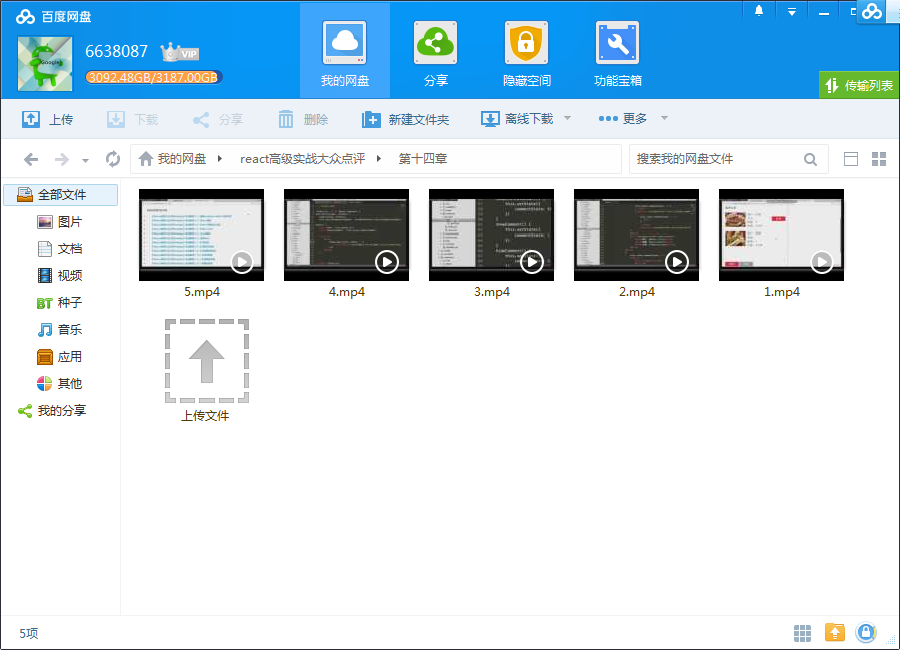

# React高级实战 打造大众点评 WebApp

## 课程介绍

使用React开发项目时，你会惊讶于它的组件化设计、它的数据驱动视图的开发方式、它的解放DOM操作，它颠覆传统的超高效率，跟随讲师一起用React从零搭建一个完善的 WebApp ，让你感受到React的魅力。

<!--more-->

## 课程章节

### 第1章 搭建 webpack + react 开发环境

前端开发早就进入工程化的年代，而以 React 为框架开发，就必须使用工程化，目前前端最强大的工程化工具就是 webpack。本章节就讲述如何使用 webpack 搭建一个能自动构建编译 React 的环境，以及使用 npm 作为依赖管理工具。本节学完之后，我们就能将编写的 React 代码自动编译为浏览器可识别的代码，直接使用浏...

### 第2章 React 基础

针对不熟悉 React 基础的同学，本章节就为你介绍 React 的基本使用，从显示最简单的 hello world 开始，到使用组件化制作页面，针对已经熟悉 React 基础的同学，本章节的后半部分讲述了我本人对 React 组件化设计、代码结构的一些思路和经验，而这些技巧是后面实战开发的理论基础，不可忽略。...

### 第3章 React 性能优化方案

作为一个称职的工程师，考虑性能是必须要做的事情之一。React 如此大型复杂的框架，存在性能问题是可以想象到的，但是官方也提出了优化方案。本章节将介绍如何检测性能问题，以及如何优化 React 的性能。

### 第4章 React-router

使用 React 开发的是一个单页面引用程序（即 SPA），SPA的页面跳转必须依靠路由来实现，而 React “御用”的路由工具就是 React-router，本章节介绍 React-router 的使用。

### 第5章 Redux 基础

当程序复杂度提高时，程序中的数据管理就变得很复杂，此时 Redux 就能派上用场。本章节介绍 Redux 的基础，使您对 Redux 有一个初步的了解，因为后面的实战开发，会用到 Redux 来存储数据，这里要把基础打好。

### 第6章 使用 fetch

使用 jQuery 开发页面是，可是使用自带的 ajax 功能获取、提交数据。而使用 React 框架时，就没必要为了 ajax 引用一个 jquery 了，这里我们推荐使用 fetch，最新的 ajax 交互方式，支持 Promise，用起来绝对简洁给力。

### 第7章 开发首页

前面基础知识介绍完，正式进入实战开发阶段，本章节开发首页。首先分析页面，拆分组件，然后开发组件，拼接页面。给您详细展示从一个空白页面到开发出最终效果的整个过程。

### 第8章 开发城市页面

本节讲述城市页面的开发，该页面中将学会如何在 React 中初步使用 Redux 存储简单的数据。

### 第9章 开发搜索结果页面

本节讲述搜索结果页的开发，该页面将为您展示常见的搜索效果如何通过 React 开发出来，并且能深刻体会到路由的使用规则，以及组件可复用带来的好处。

### 第10章 开发详情页

本节讲述详情页的开发，通过上两节的实战课程，学生讲会更加快速高效的学会拆分组件，复用已有组件，最后拼装成页面。

### 第11章 开发登录页面

本节讲述登录页面的开发，将再次使用 Redux 存储数据，并判断用户的登录状态，以及登录之后跳转的处理。

### 第12章 收藏和购买功能

通过本节收藏和购买的功能开发，您将体会到更加复杂的 Redux 应用。

### 第13章 开发用户中心页

本节讲述用户中心页面的开发，该页面是一个比较基础的页面，跟之前一样拆分组件、复用组件、拼装页面。此时您应该能快速高效的掌握课程的全部内容。

### 第14章 评价功能

通过本节评价功能，您将学会在 React 中如何操作页面变化，即数据驱动视图的开发方式。另外，您将学会使用 fetch 提交数据，而之前都是用 fetch 获取数据。

### 第15章 扩展-项目代码版本升级

项目代码版本升级，webpack2升级到webpack3。

## 更多教程

教程不断整理更新中，以上截图仅供参考，如需了解更多视频教程的详细信息请到如下地址查看：

[教程分类说明](https://itvedios.github.io/categories/)：<https://itvedios.github.io/categories/>

## 获取方式

[关于教程、获取方式、温馨提示](https://itvedios.github.io/about/)
