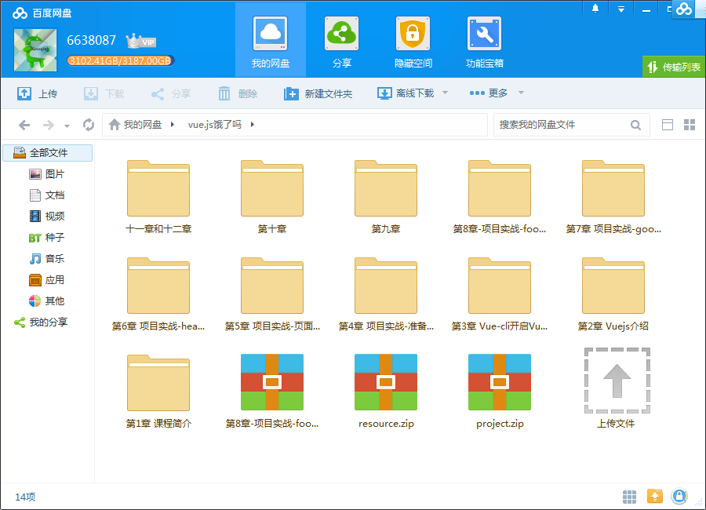
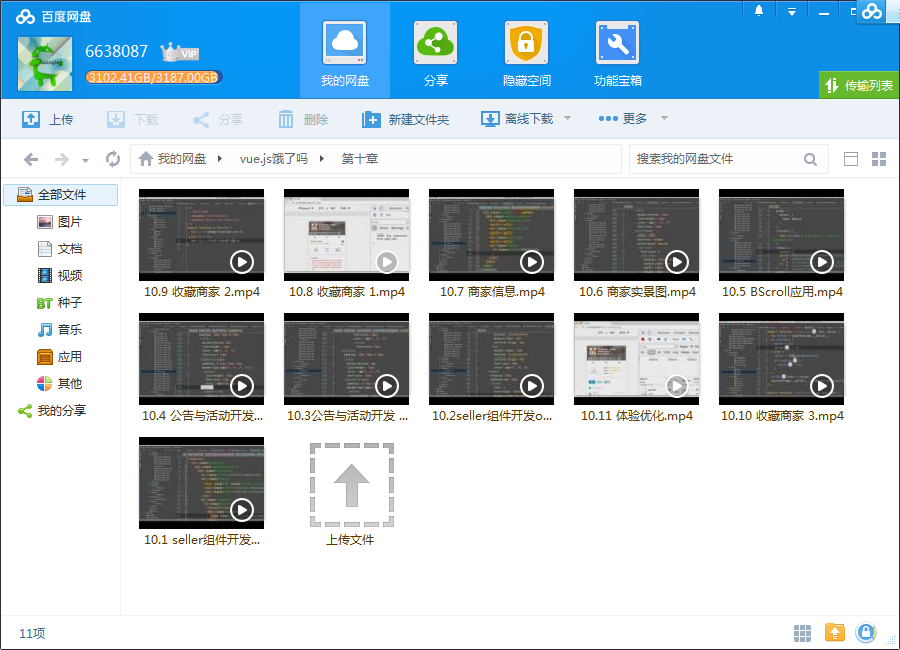
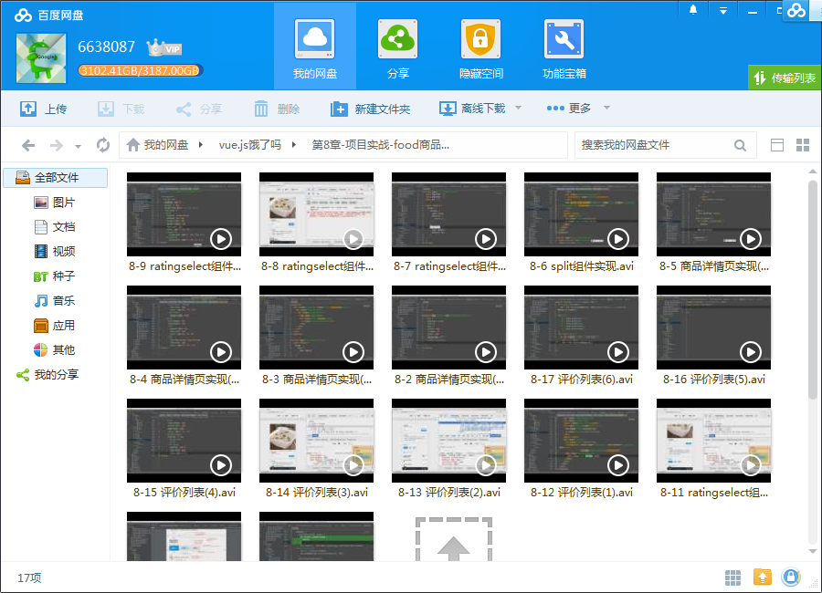
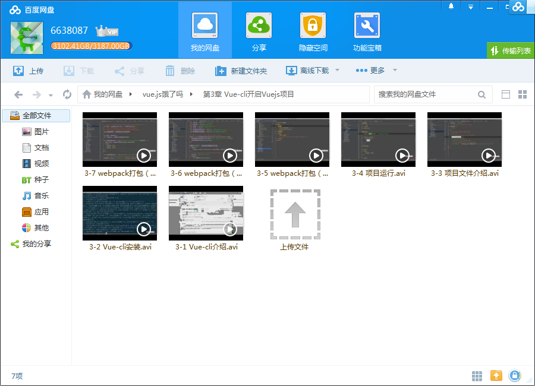

# Vue.js高仿饿了么外卖App 1.0到2.0版本完美升级

## 课程介绍

Vue.js 是最火的前端框架，几乎没有之一，资深程序员这样评价它：“Vue.js 兼具 Angular.js 和 React.js 的优点，并剔除它们的缺点”，很多前端工程师都视Vue.js为心中最理想的框架。

<!--more-->

## 课程章节

### 第1章 课程简介

介绍课程的学习目标和学习内容。

### 第2章 Vuejs介绍

从前端开发趋势分析开始，引入 MVVM 开发框架和 Vue.js，接着对比流行框架Angular 和 React，最后详细介绍 Vue.js 的核心思想-数据驱动和组件化。

### 第3章 Vue-cli 开启 Vuejs 项目

介绍 Vue 项目的脚手架，如何安装，对脚手架生成的目录文件做介绍，介绍 Vue 组件的编写方法，最后运行 demo 项目并介绍 webpack 构建脚本来说明 demo 的运行原理。

### 第4章 项目实战-准备工作

分析外卖 APP 商家页面的需求，准备图片资源，利用 icon-moon 把 svg 制作成图标字体，对代码的目录结构设计，最后 mock 测试数据。

### 第5章 项目实战-页面骨架开发

设计页面的骨架，拆分组件，商品、评论和商家详情页利用 Vue-router 做切换，最后还介绍了 flex 弹性布局以及移动端 1 像素 border 实现的小技巧。

### 第6章 项目实战-header组件开发

编写 header 头部组件，应用 Vue-resource 从服务端读取数据，介绍如何在 Vue.js 中使用过渡动画，如何编写 css sticky footer 布局，如何从需求中抽象出 star 星星组件。

### 第7章 项目实战-goods 商品列表页开发

编写 goods 商品组件，包括它的子组件 shopcart 购物车。介绍了如何在 Vue.js 应用第三方 JS 插件 better-scroll实现列表滚动，并配合 Vue.js 的计算属性来实现左右列表的联动。应用了自定义 Vue.js 过渡动画实现了购物车的飞入动画效果，介绍了在 Vue.js中父子组件如何通讯。...

### 第8章 项目实战-food 商品详情页实现

编写 food 商品详情页组件，介绍了图片占位的技巧，并从需求中抽象出的 split 分隔组件和 ratingselect 评论组件，实现自定义过滤器 datefilter。

### 第9章 项目实战-ratings评价列表页实现

编写 ratings 评价列表页，感受在 Vue.js 中复用组件的好处，实现快速开发。

### 第10章 项目实战-seller 商家详情页实现

编写 seller 商家详情页，实现一套通用移动端数据存取方案，以及对项目做一些体验上的优化。

### 第11章 项目实战-项目编译打包

上线前的最后一步，编译打包Vue.js 项目。介绍了 webpack 编译时的配置，如何利用node.js 开启一个server本地调试。

### 第12章 课程总结

对课程做总结，并列出了课程所提到的主要知识点的链接，作为课程的延伸学习。

### 第13章 项目从 vue.js1.0 向 2.0 升级

本章节把项目从1.0向2.0升级向大家做了简要的介绍。

## 更多教程

教程不断整理更新中，以上截图仅供参考，如需了解更多视频教程的详细信息请到如下地址查看：

[教程分类说明](https://itvedios.github.io/categories/)：<https://itvedios.github.io/categories/>

## 获取方式

[关于教程、获取方式、温馨提示](https://itvedios.github.io/about/)
