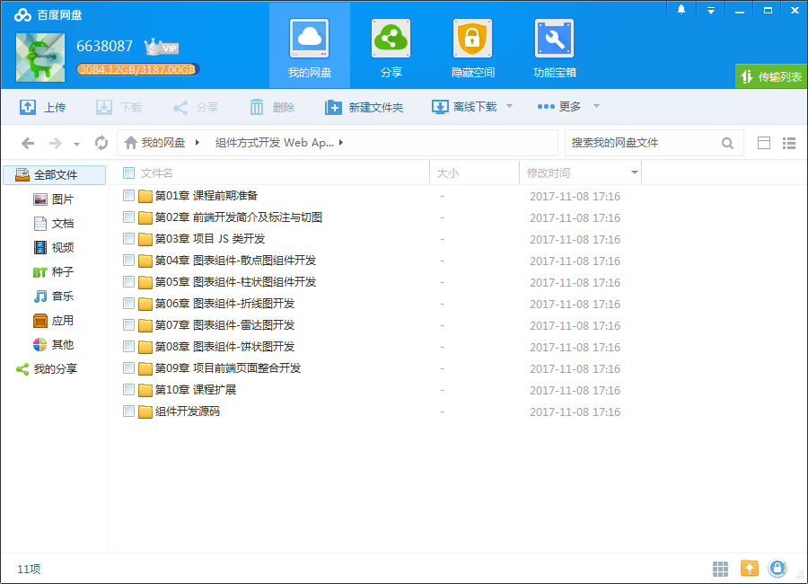
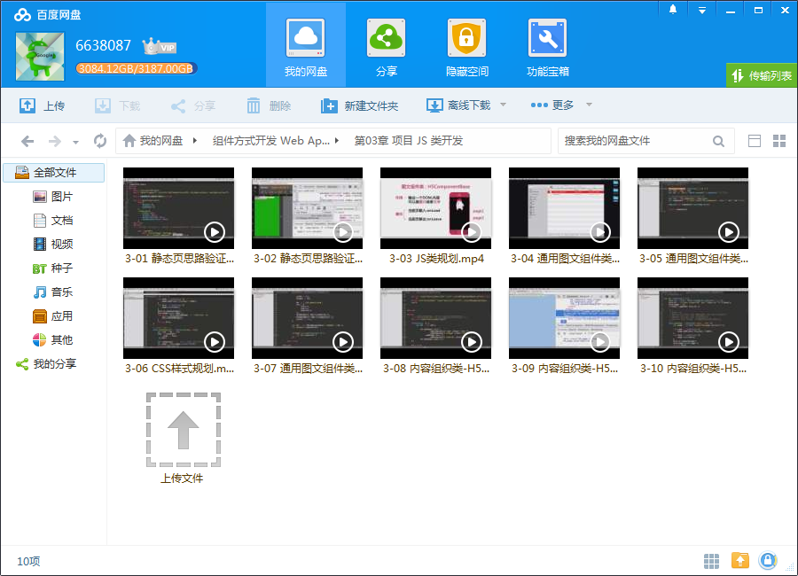
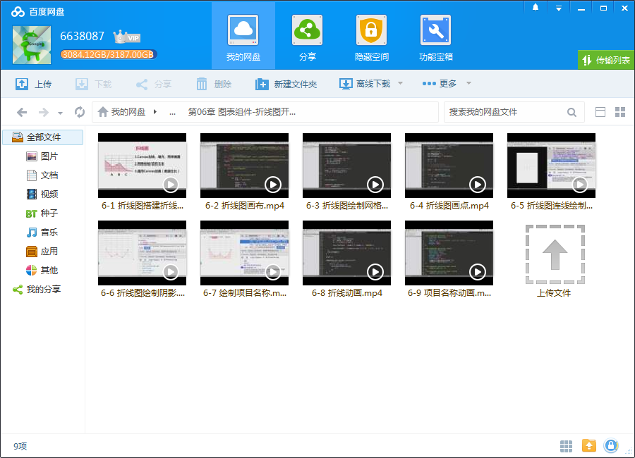

# Web App用组件方式开发全站

## 课程介绍

不仅刷爆朋友圈，HTML5确实可以让人更好的看清数据的真相。

## 课程章节

### 第1章 课程前期准备

在学习正式课程之前了解下“WEB项目开发流程”以及在“流程中的角色”。

### 第2章 前端开发简介及标注与切图

本章节对本项目前端开发具体做什么做了简单介绍，并带领用户进行 psd 图标注与切图。

### 第3章 项目 JS 类开发

本章节讲师会带你规划和开发 JS 项目所用的“通用图文组件“- H5ComponentBase 和“内容组织功能类“ - H5。

### 第4章 图表组件-散点图组件开发

讲师先对图片组件做整体介绍，然后手把手带你详细开发散点图组件，直到你能够独自完成。

### 第5章 图表组件-柱状图组件开发

先跟着讲师学开发水平柱图，逐步掌握水平柱图原理，然后自己独立开发垂直柱图。

### 第6章 图表组件-折线图开发

讲师先带你使用 Canvas 开发折线图，从中掌握折线图的生长动画原理，然后真正参与到项目实战中，独立完成改变生长动画的任务。

### 第7章 图表组件-雷达图开发

已经掌握折线图开发的你，跟着讲师的教学练习节奏，完成使用 Canvas 来完成雷达图的开发也是 So easy。

### 第8章 图表组件-饼状图开发

本章节向你揭示饼状图的开发原理，在章节的结束你就可以独立开发完成环状图开发了。

### 第9章 项目前端页面整合开发

前面章节的学习积累很重要！这一节讲师就会带你把前面各个开发出来的页面整合在一起，你会感觉到前面类开发的好处，可以减少很多代码的量。

### 第10章 课程扩展

有问题需要解决？随时在问答区提出来！讲师会把大家典型的问题做指点和解惑，比如饼状图项目文本发生重叠的解决方法等；最后还带着你把项目最后首页的 Loading 功能完成。

### 第11章 大任务-综合实战

实践大作业环节！检查你学习效果的时候到了：你完成项目任务后如果想知道自己的项目代码写得如何，可以申请代码点评。授课讲师将会点评你的代码，帮你查漏补缺。

## 更多教程

教程不断整理更新中，以上截图仅供参考，如需了解更多视频教程的详细信息请到如下地址查看：

[教程分类说明](https://itvedios.github.io/categories/)：<https://itvedios.github.io/categories/>

## 获取方式

[关于教程、获取方式、温馨提示](https://itvedios.github.io/about/)
