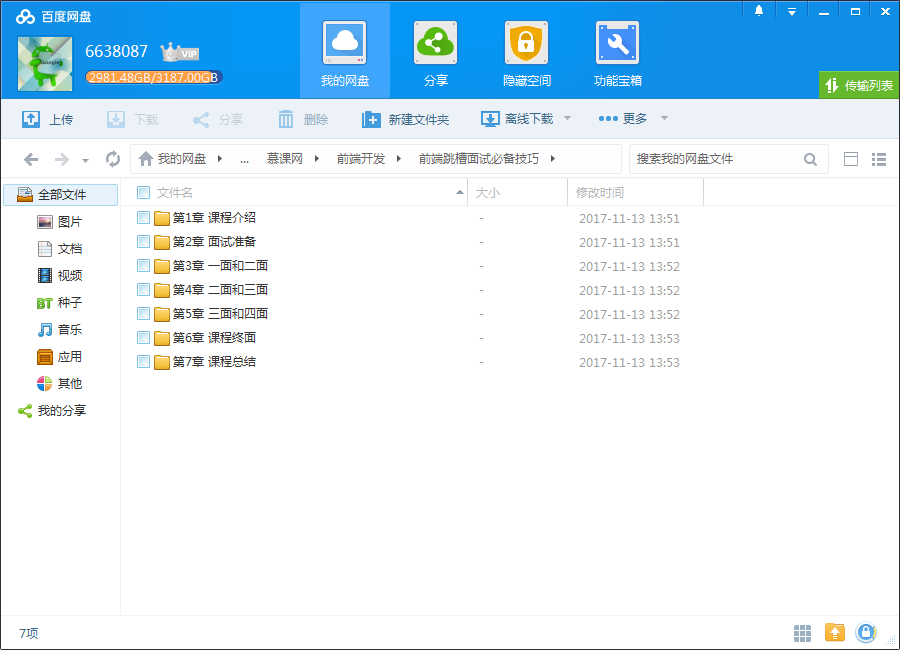
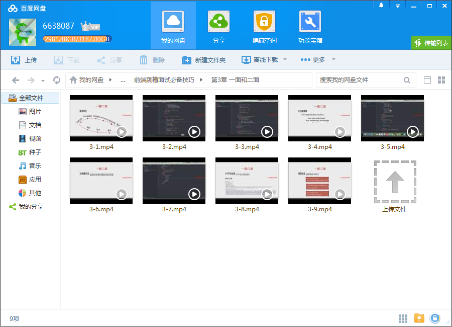

# 前端跳槽面试必备技巧

## 课程介绍

面试不是单纯考察技术，而是综合能力的考查，关于面试， JD描述怎么看，知识怎么复习，问题如何回答，项目怎么准备，和负责人如何沟通，HR印象怎么留……别小瞧这些问题，往往就是这些决定你能否成功应聘，这次课程教你如何拿下前端Offer！

## 课程章节

### 第1章 课程介绍

很多同学对面试不够了解，不知道如何准备，对面试环节的设置以及目的不够了解，因此成功率不高。通常情况下校招生面试的成功率低于1%，而社招的面试成功率也低于5%，所以对于候选人一定要知道设立面试的初衷以及每个环节的意义，有的放矢...

### 第2章 面试准备

通过现场分析互联网的JD，让学员掌握分析公司对技术的要求和定位，进而知道自己是否适合该岗位以及应该如何准备。想提高面试成功率一定要了解公司的业务，去分析公司对应业务的站点了解他们使用的技术栈，进而去准备相关的知识，最后一小节关于自我介绍，大多数面试失败都是简历和自我介绍导致的，只是大多数人并不自知。...

### 第3章 一面/二面

描述在一面/二面要掌握什么技巧，根据前端的知识点划分并分别出一至两道面试题，根据真实面试的发问方式进行考察，并给出对应知识点的讲解、代码演示以及注意事项。

### 第4章 二面/三面

二面/三面更侧重于对前端知识的深度和广度来进行考察，这个环节不再局限于基础知识，更多的是考察浏览器、JS引擎、项目实战等方面。本环节通过几大类题目帮大家梳理面试频率较高的重点和难点。

### 第5章 三面/四面

描述在三面/四面要掌握什么技巧，在这个环节对工作2-3年的人特别重要，这个环节的面试官一般是技术负责人或者业务负责人，他们对候选人的考察不再局限于技术，更侧重综合能力。

### 第6章 课程终面

这个环节同样不可忽视，情商、性格、潜力、薪资匹配度都可能成为候选人失败的“主观因素”。如何掌握面试技巧顺利拿到offer，站好最后一班岗吧

### 第7章 课程总结

课程会涉及很多由点到面的知识点，对课程的学习还远远不够，学习、理解、吸收还需要自身的努力才能发挥更佳的效果，大家加油。

## 更多教程

教程不断整理更新中，以上截图仅供参考，如需了解更多视频教程的详细信息请到如下地址查看：

[教程分类说明](https://itvedios.github.io/categories/)：<https://itvedios.github.io/categories/>

## 获取方式

[关于教程、获取方式、温馨提示](https://itvedios.github.io/about/)
