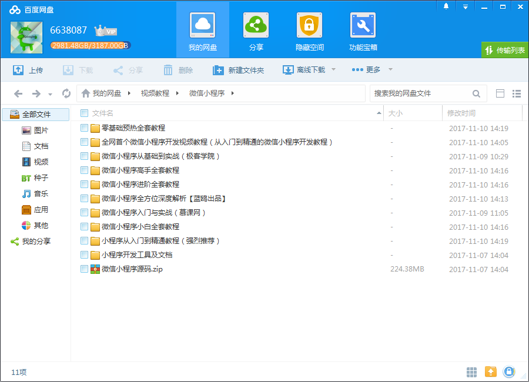
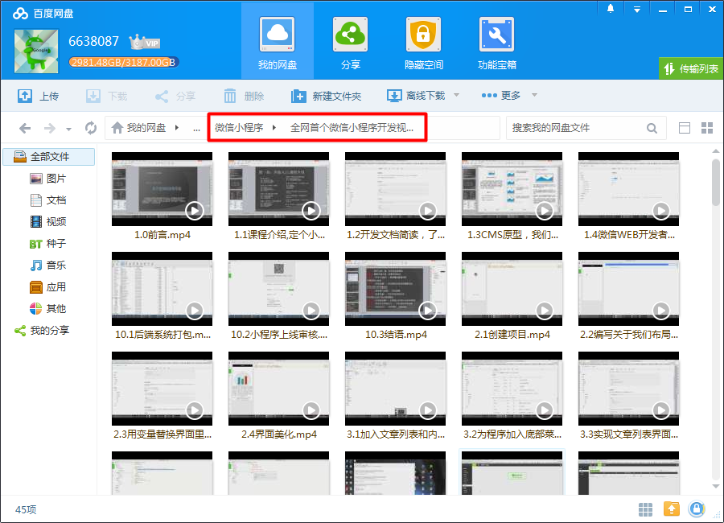
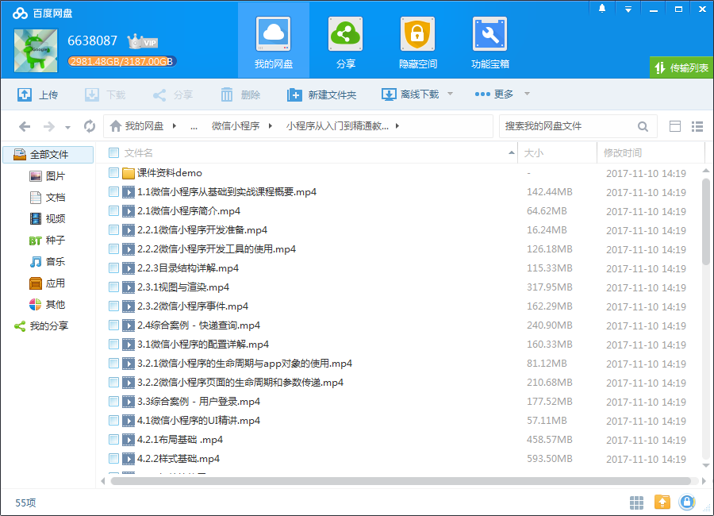
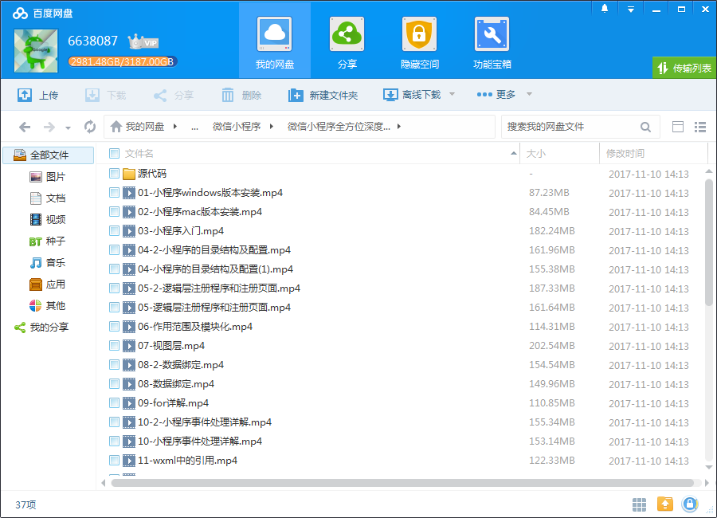
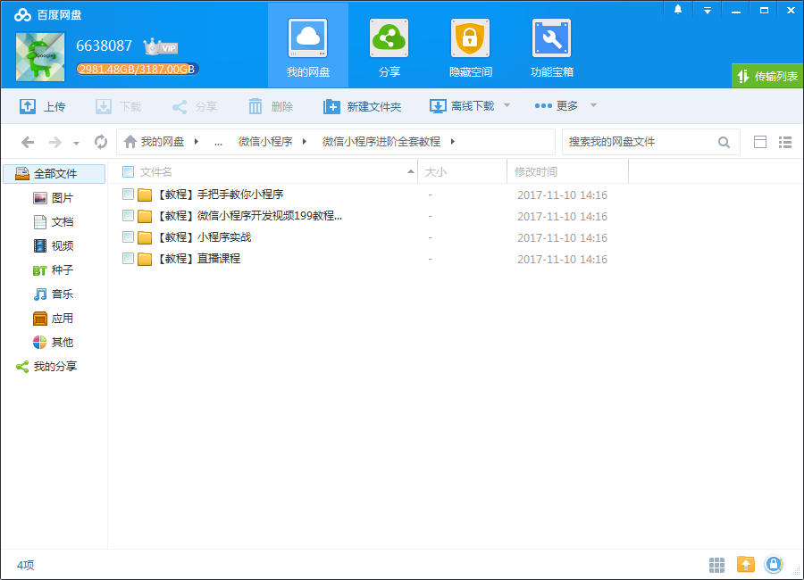

# 微信小程序开发教程

## 微信小程序

- 零基础预热全套教程
- 微信小程序从基础到实战
- 微信小程序入门与实战
- 微信小程序小白全套教程
- 微信小程序进阶全套教程
- 微信小程序高手全套教程
- 微信小程序全方位深度解析【蓝鸥出品】
- 小程序从入门到精通教程（强烈推荐）
- 小程序开发工具及文档
- 从入门到精通的微信小程序开发教程（全网首个微信小程序开发视频教程）

<!--more-->

## 更多教程

教程不断整理更新中，以上截图仅供参考，如需了解更多视频教程的详细信息请到如下地址查看：
[教程分类说明](https://itvedios.github.io/categories/)：<https://itvedios.github.io/categories/>

## 获取方式

[关于教程、获取方式、温馨提示](https://itvedios.github.io/about/)
