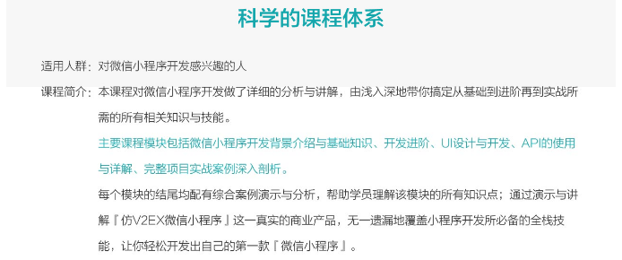
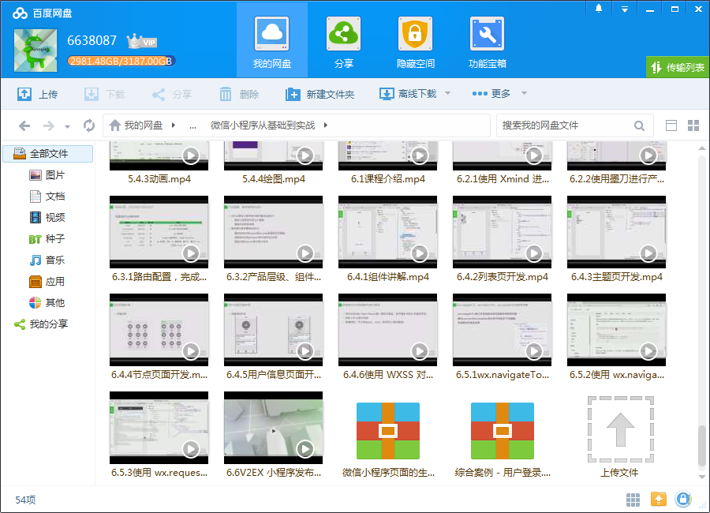
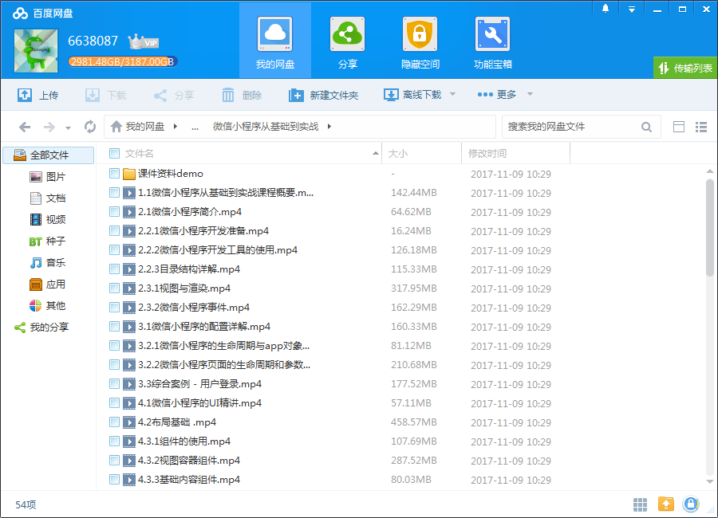

# 微信小程序从基础到实战

## 课程简介

本课程对微信小程序开发做了详细的分析与讲解，由浅入深地带你搞定从基础到进阶再到实战所需的所有相关知识与技能。

<!--more-->

## 课程大纲

## 更多教程

教程不断整理更新中，以上截图仅供参考，如需了解更多视频教程的详细信息请到如下地址查看：
[教程分类说明](https://itvedios.github.io/categories/)：<https://itvedios.github.io/categories/>

## 获取方式

[关于教程、获取方式、温馨提示](https://itvedios.github.io/about/)
