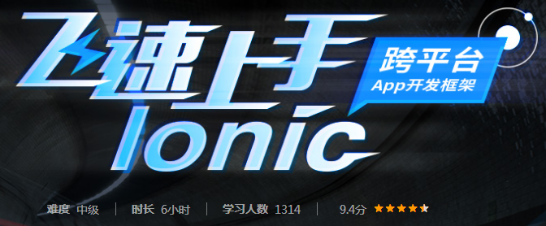
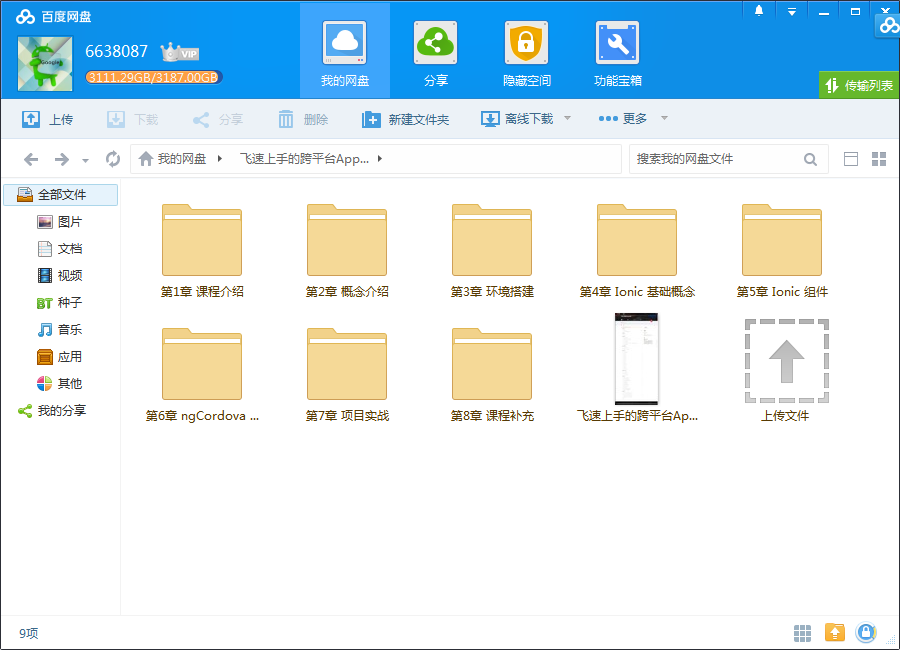
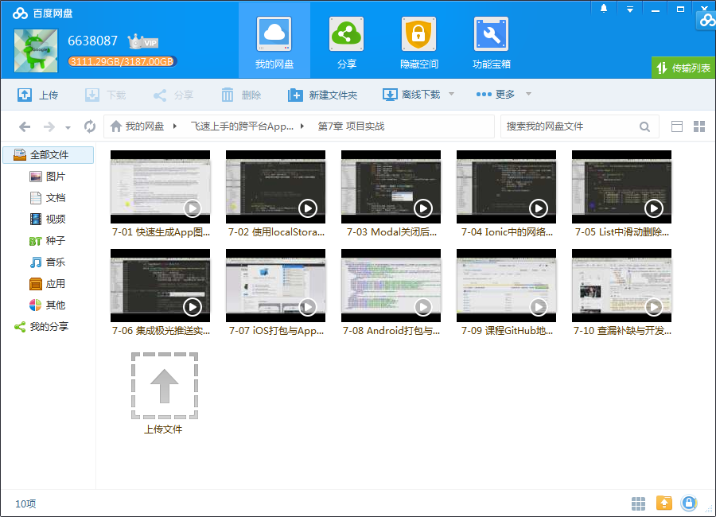
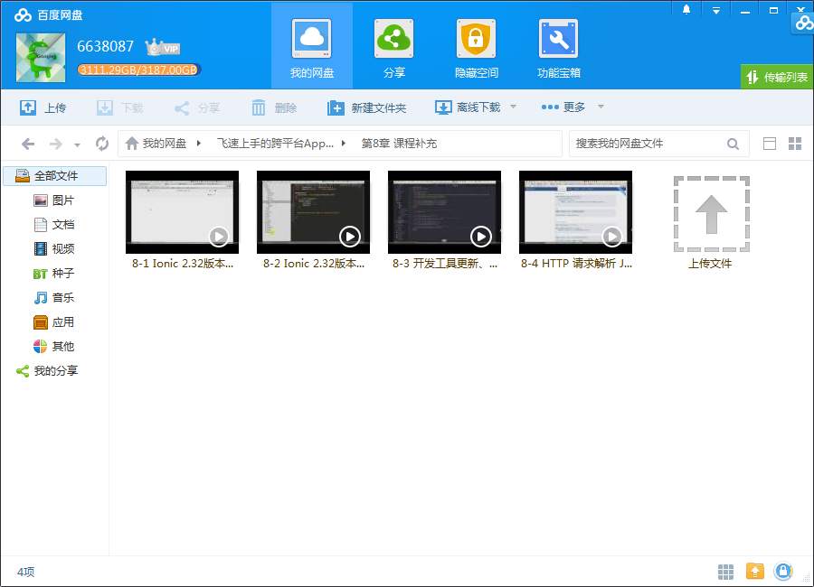

# Ionic飞速上手的跨平台App开发

## 课程介绍

最具潜力的HTML5移动App开发框架Ionic，天然的跨平台属性，通吃Android及iOS，简洁、易用，让你飞速上手。

## 课程章节

### 第1章 课程介绍

介绍课程的教学大纲，让大家对整个课程的结构有所了解。

### 第2章 概念介绍

介绍 Ionic 的发展、概念、可以开发的应用平台，相关资源、甚至包括 Ionic 的正确读音。

### 第3章 环境搭建

介绍 Ionic 开发环境以及不同移动平台的开发环境搭建。

### 第4章 Ionic 基础概念

介绍 Ionic 的项目结构、生命周期以及包管理的方法。

### 第5章 Ionic 组件

着重介绍 Ionic 中经常使用到的组件，课程主要采用3分讲解组件概念，7分使用实际案例来带领大家一起通过代码实现组件的学习过程，并为后期的项目实现打下基础。

### 第6章 ngCordova 组件

主要给大家讲解下 ngCordova 组件的功能、使用方法，这样大家在开发过程中遇到需要使用的 ngCordova 组件，可以参考此章节的课程去自行查找资料、学习相关组件的使用。

### 第7章 项目实战

精讲完整的一个项目从无到有的开发过程，每一个章节都是大家非常需要了解的课程，这些知识点也是大家虽然学习了概念后仍然觉得无从下手开发项目需要了解的内容。

### 第8章 课程补充

对 Ionic 2.32版本中的一些差异以及学习方法论进行讲解。

## 更多教程

教程不断整理更新中，以上截图仅供参考，如需了解更多视频教程的详细信息请到如下地址查看：

[教程分类说明](https://itvedios.github.io/categories/)：<https://itvedios.github.io/categories/>

## 获取方式

[关于教程、获取方式、温馨提示](https://itvedios.github.io/about/)
