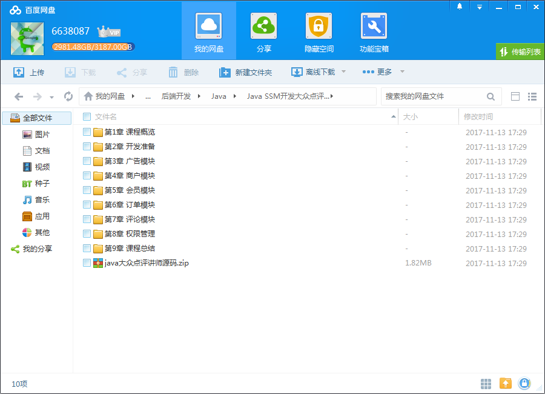
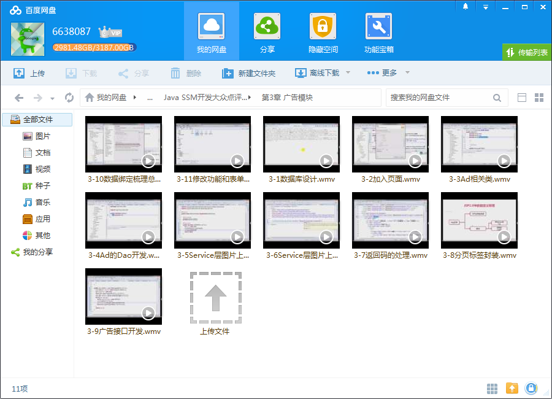
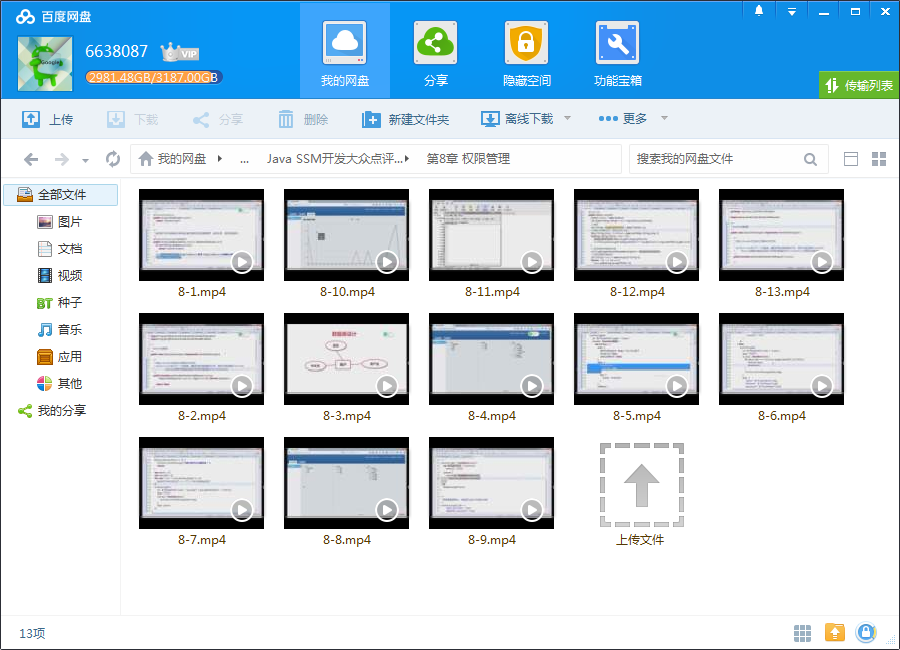

# IT段子手详解MyBatis遇到Spring 秒学Java SSM开发大众点评

## 课程介绍

再续MyBatis前缘，利用复杂SQL简化实现。体验前后端分离开发，夯实Java SSM（Spring SpringMvc MyBatis）基础。讲原理，追源码，SSM相关知识点梳理总结，新手快速进阶，毕设好选择。

## 课程章节

### 第1章 课程概览

介绍课程目标、开发内容、功能划分、开发顺序，开发所需要的前置知识及环境准备，并且介绍了与课程相关的前后端分离的思想，架构演进过程。

### 第2章 开发准备

演示前端工程环境搭建以及启动步骤，介绍了后台工程初始SSM框架目录结构，将前后端打通，并将后台管理使用的界面原型加入后台工程中，形成一个完整可用的前后台联动的原型。拓展的谈了谈HTTP API和RESTFul API的趣闻。

### 第3章 广告模块

正式开发第一个模块--广告模块，从广告实体的设计到广告的维护再到广告接口的实现，在这个过程中分享了相关的内容：Spring MVC上传图片的处理，用自定义标签封装分页，Spring MVC的数据绑定，前端验证框架jQuery Validation Plugin， 简单介绍了一些我们在开发中应该注意的环节，如：通过看真实环境的简易架构图考虑...

### 第4章 商户模块

商户模块的开发，分享了与广告模块不同的内容：如何在Spring MVC上应用RESTful， 当应用RESTful时与form表单上传文件合在一起产生新的问题，与大家一起追踪Spring源码解决问题，并且回顾了Spring MVC的工作流程。 另外还介绍了Mybatis一对多、多对一关系的处理。...

### 第5章 会员模块

完成了会员登录功能，因为这个功能需要，详细的解释了两种会话管理方式的过程，并用其中一种会话管理方式实现了会员 登录。同时还介绍了单机部署与集群部署对缓存的处理、logback的配置与使用。

### 第6章 订单模块

实现订单接口，在这里主要介绍将一些可以不要求实时查询的数据，降为准实时数据，异步更新查询结果，用空间换时间的思想， 这样可以加快查询速度，抗住大并发量的访问， 为了达到这个目的主要分享了定时器相关的内容，介绍了各种定时器，并最终选用Spring task完成此功能。...

### 第7章 评论模块

本章相当于阶段性小结，利用前面分享过的知识点就可以完成评论模块相关功能， 这里主要提醒大家从业务的角度应该注意哪些地方，用分享的知识点解决这些问题时应注意哪些方面，如何灵活的利用已分享的知识。

### 第8章 权限管理

在前面的章节已将前端接口部分全部完成，本章是为了让后台管理功能更加完善， 加入了权限管理，从登录开始、利用Spring拦截器实现session拦截，并介绍对form表单请求与ajax请求是如何分别处理session超时的， 规划如何利用Spring拦截器继续实现权限拦截，从实体设计开始，到维护页面的设计，用ztree实现维护页面， 然后...

### 第9章 课程总结

对整个课程做个大的总结，分别从几个角度总结：我们得到了什么、我们还有哪些事可以完善、还有哪些内容可以适当去扩展了解。 我们如何找到适合自己的、更好的学习方法，我们能达到什么样的境界去看待这个系统、技术、甚至是我们所处的这个行业， 我做了一件抛砖引玉的事来引发大家的思考，让大家可以得到真正属于自己的总...

## 更多教程

教程不断整理更新中，以上截图仅供参考，如需了解更多视频教程的详细信息请到如下地址查看：

[教程分类说明](https://itvedios.github.io/categories/)：<https://itvedios.github.io/categories/>

## 获取方式

[关于教程、获取方式、温馨提示](https://itvedios.github.io/about/)
