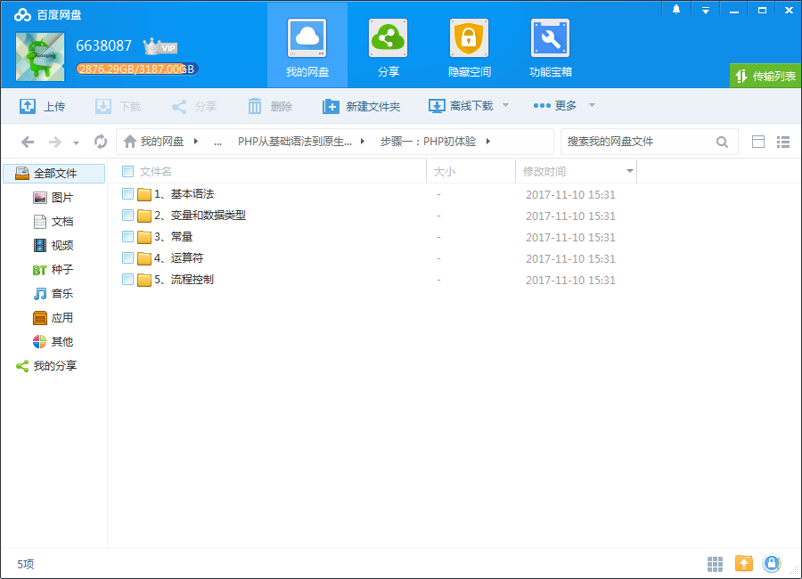
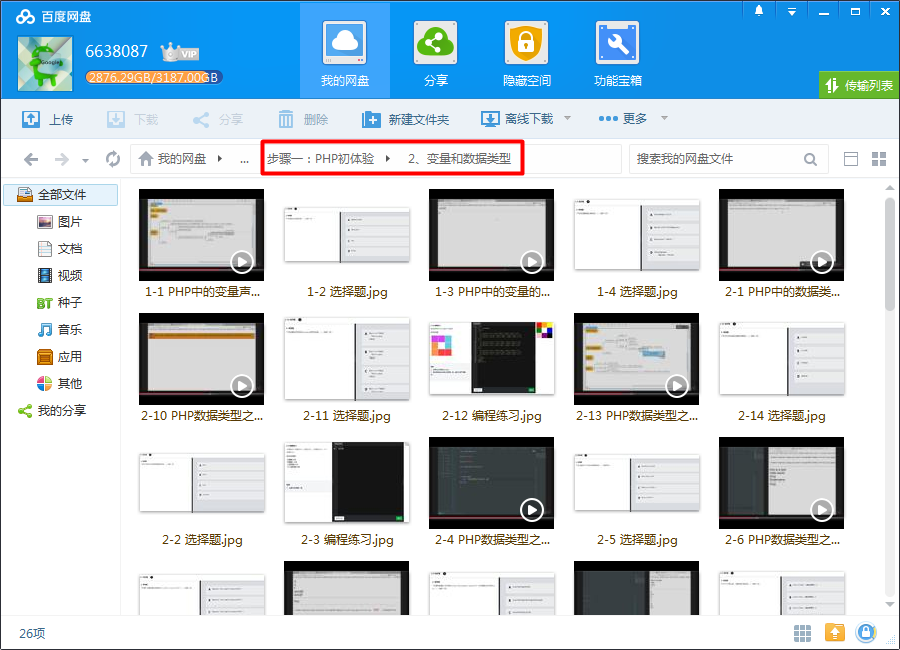
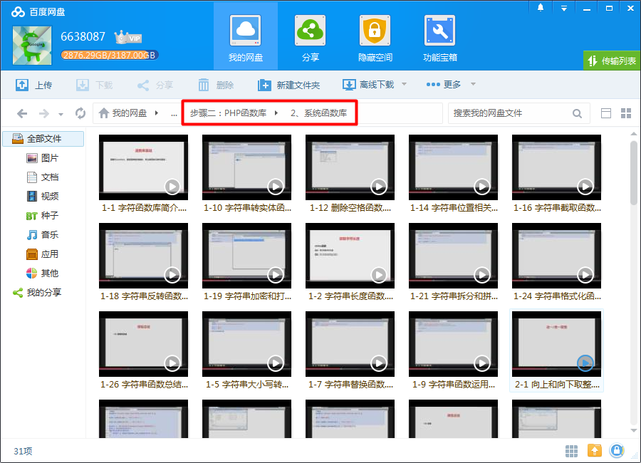
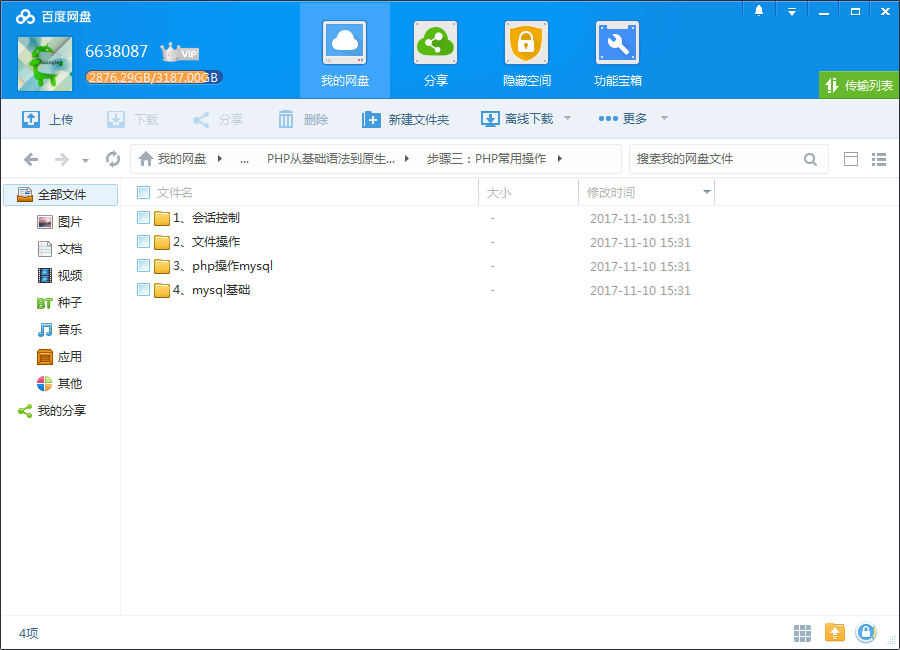
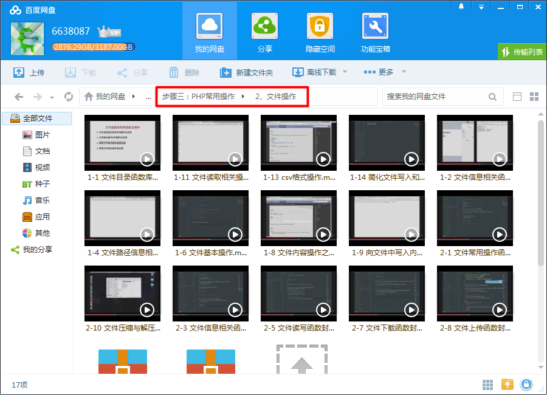
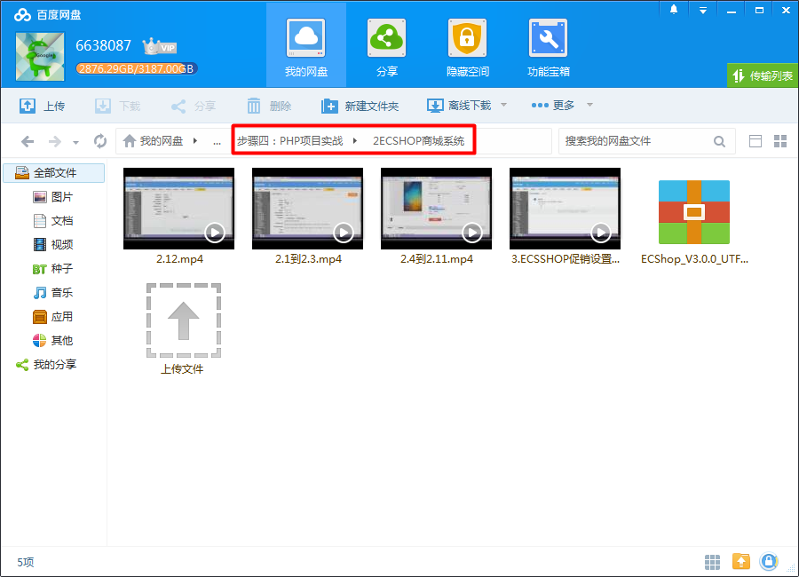

# PHP从零基础到原生项目开发

PHP入门从这里开始

## 我能get哪些技能？

本专题将带你由浅入深，从易到难系统的学习PHP知识；并结合多个项目，将零碎的知识点串联成一个完整体系；
让你学会PHP知识的同时，还掌握科学的学习方法。

## 课程安排

<!--more-->

### 步骤1: PHP初体验

本阶段主要介绍PHP运行环境、PHP的基本语法、常量和变量的使用、运算符的作用以及流程控制，让我们了解PHP语言，进入代码的殿堂。

### 步骤2: PHP函数库

本阶段主要介绍自定义函数的定义和用法，字符串函数库、数学函数库、日期时间函数库三大系统函数库，以及数组和数组的运用。

### 步骤3: PHP常用操作

本阶段主要学习了会话控制中的SESSIONH和COOKIE、文件操作、MySQL数据库以及PHP面向过程方式操作数据库的方法。

### 步骤4: PHP项目实战

在本阶段，我们将综合使用前面所学的知识，使用PHP原生方式完成一个优化商城项目，并为大家介绍一款大型商城系统ECSHOP的使用。

## 更多教程

教程不断整理更新中，以上截图仅供参考，如需了解更多视频教程的详细信息请到如下地址查看：
[教程分类说明](https://itvedios.github.io/categories/)：<https://itvedios.github.io/categories/>

## 获取方式

[关于教程、获取方式、温馨提示](https://itvedios.github.io/about/)
