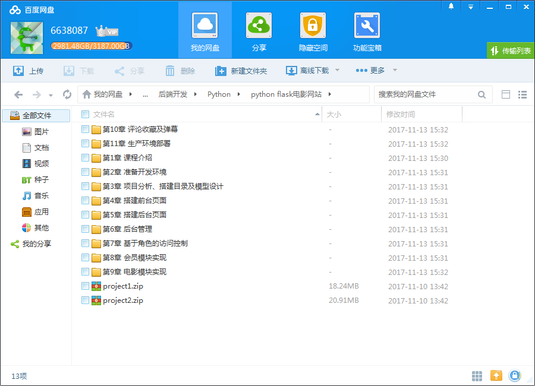
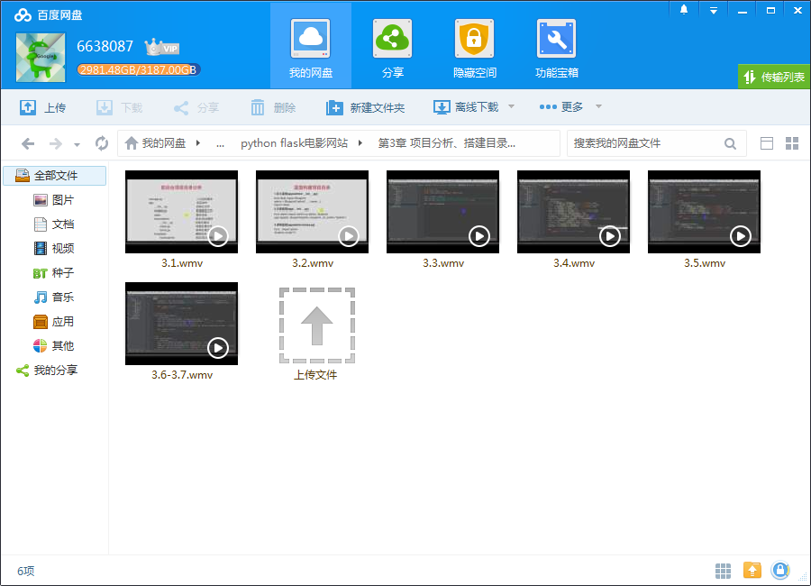
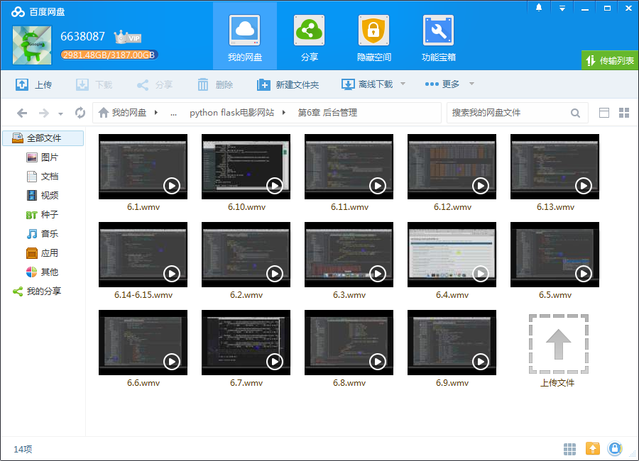

# Python Flask 构建微电影视频网站

## 课程介绍

Flask是Python高手公认的、好用的轻量级框架，微内核＋各种扩展插件，能让你轻松灵活的应对各种大小项目的开发，这次，在纯实战的生产环境中，给你讲透Flask，让你达到实际工作1.5年以上的水平。

<!--more-->

## 课程章节

### 第1章 课程介绍

介绍构建微电影网站的整体流程、flask框架的优点及特性、结合其他python web框架对比、学完本门课程掌握的知识。

### 第2章 准备开发环境

介绍在windows和mac os系统上安装开发环境、pip下载工具的安装及使用、虚拟化环境virtualenv的安装及使用、flask的安装、实现第一个flask程序。

### 第3章 项目分析、搭建目录及模型设计

实现微电影网站前后台项目目录结构、使用flask blueprint蓝图模块构建目录合理优化项目结构、根据各模块业务需求使用flask sqlalchemy定义数据模型、模型生成数据表。

### 第4章 搭建前台页面

实现前台html布局页面搭建、jinjia2引擎语法、引入静态资源文件、404错误页面的处理。

### 第5章 搭建后台页面

实现后台html布局页面搭建、jinjia2引擎语法、引入静态资源文件、404错误页面的处理。

### 第6章 后台管理

实现后台管理系统使用flask sqlalchemy结合mysql数据库进行增删改查操作、分页的使用、路由装饰器定义、模板中变量调用、登录会话机制、上传文件、flask wtforms表单使用。

### 第7章 基于角色的访问控制

实现flask自定义应用上下文、自定义权限装饰器对管理系统进行基于角色权限的访问控制。

### 第8章 会员模块实现

实现会员注册、登录sesion会话机制、修改资料、修改密码、会员登录日志等功能。

### 第9章 电影模块实现

实现上映预告幻灯片、关联查询实现标签筛选、数据分页查询实现电影分页、模糊查询实现电影搜索、jwplayer.js插件，实现电影播放等功能。

### 第10章 评论收藏及弹幕

实现电影评论添加及列表、数据查询实现统计播放量和评论量、jquery ajax实现收藏电影，flask结合redis消息队列实现电影弹幕，bug处理等功能。

### 第11章 生产环境部署

实现在centos服务器上搭建nginx+mysql+python环境、使用nginx反向代理多端口多进程部署微电影网站、配置nginx流媒体实现限制下载速率和单个IP发起的播放连接数访问限制。

## 更多教程

教程不断整理更新中，以上截图仅供参考，如需了解更多视频教程的详细信息请到如下地址查看：

[教程分类说明](https://itvedios.github.io/categories/)：<https://itvedios.github.io/categories/>

## 获取方式

[关于教程、获取方式、温馨提示](https://itvedios.github.io/about/)
