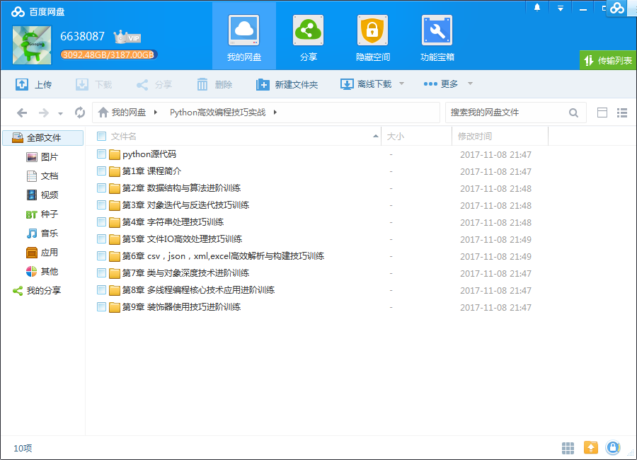
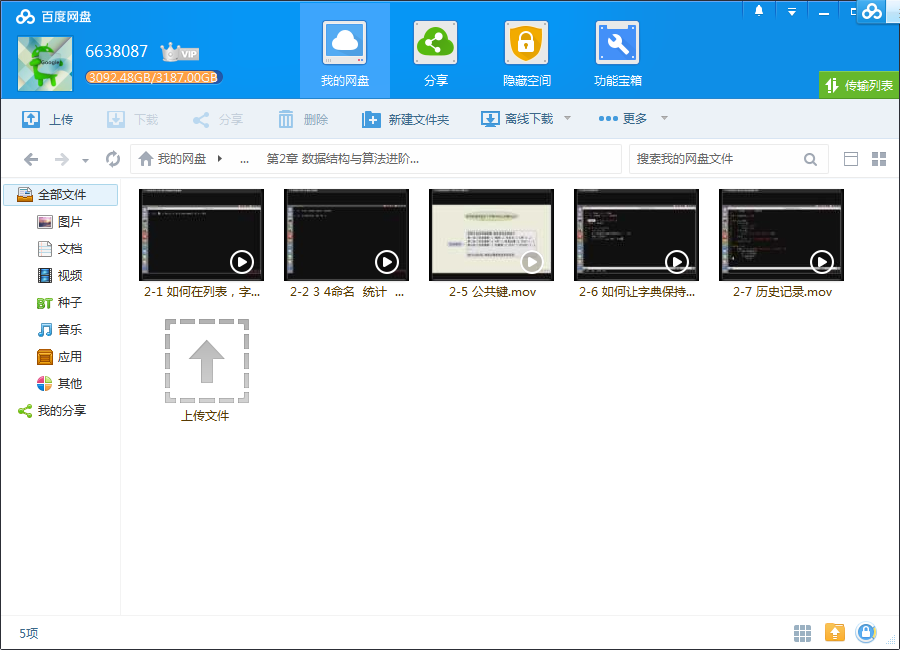
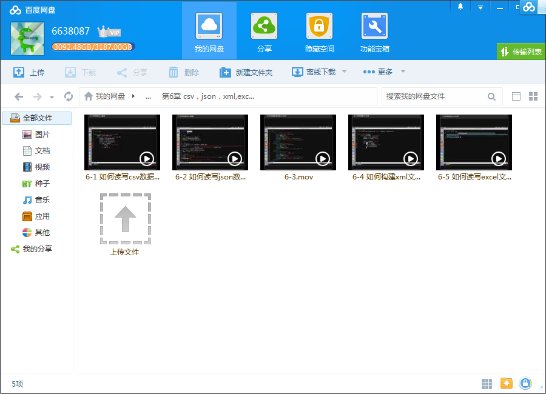
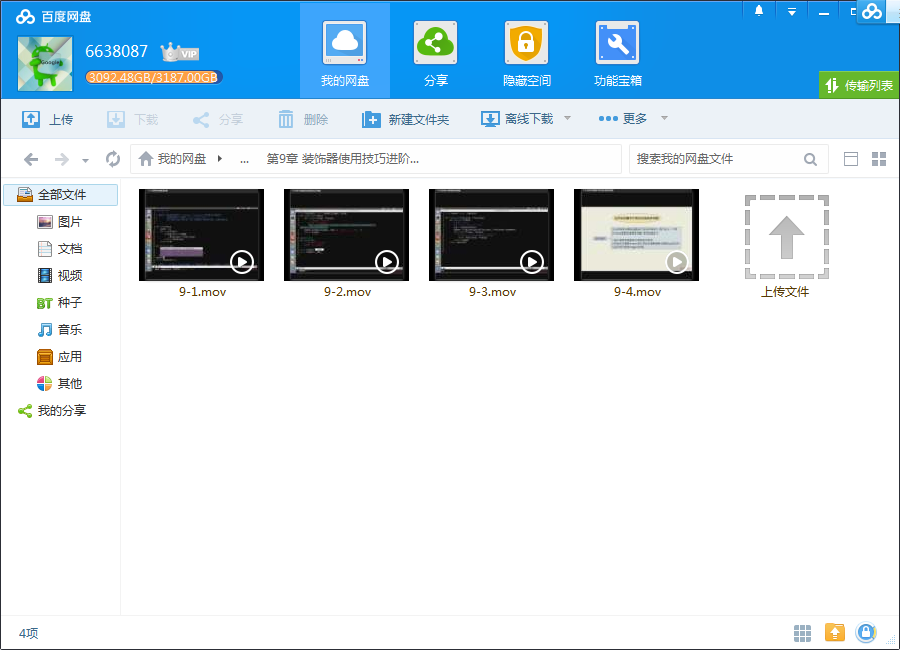

# Python高效编程技巧实战

## 课程介绍

精选50个Python各领域开发及面试常见问题作为训练任务，每个任务先提出问题，然后分析问题、并给出高效的解决办法，最后手把手带你解决问题，全面提升用Python快速解决问题与高效编程的能力。

<!--more-->

## 课程章节

### 第1章 课程简介

如果你想用python从事多个领域的开发工作，且有一些python基础， 想进一步提高python应用能力和编程技巧， 那么本课程就非常适合你。 本课程将从实际编程与面试中常见的50个典型问题出发，分析问题， 列举场景，挑选高效、简洁的解决办法，手把手代码实战，最终提高解决问题的能力。...

### 第2章 数据结构与算法进阶训练

通过7个小节，提高数据筛选，排序，查找，统计，记录等方面的处理能力： 2-1 如何在列表,字典, 集合中根据条件筛选数据 2-2 如何为元组中的每个元素命名, 提高程序可读性 2-3 如何统计序列中元素的出现频度 2-4 如何根据字典中值的大小, 对字典中的项排序 2-5 如何快速找到多个字典中的公共键(key) 2-6 如何...

### 第3章 对象迭代与反迭代技巧训练

通过6个小节，学会巧妙解决对象迭代与反迭相关问题： 3-1 如何实现可迭代对象和迭代器对象(1) 3-2 如何实现可迭代对象和迭代器对象(2) 3-3 如何使用生成器函数实现可迭代对象 3-4 如何进行反向迭代以及如何实现反向迭代 3-5 如何对迭代器做切片操作 3-6 如何在一个for语句中迭代多个可迭代对象...

### 第4章 字符串处理技巧训练

通过6个小节，提高在复杂场景下处理字符串的技巧： 4-1 如何拆分含有多种分隔符的字符串 4-2 如何判断字符串a是否以字符串b开头或结尾 4-3 如何调整字符串中文本的格式 4-4 如何将多个小字符串拼接成一个大的字符串 4-5 如何对字符串进行左, 右, 居中对齐 4-6 如何去掉字符串中不需要的字符...

### 第5章 文件I/O高效处理技巧训练

通过6小节，学会高效处理文件I/O相关问题的技巧： 5-1 如何读写文本文件 5-2 如何处理二进制文件 5-3 如何设置文件的缓冲 5-4 如何将文件映射到内存 5-5 如何访问文件的状态 5-6 如何使用临时文件

### 第6章 csv，json，xml,excel高效解析与构建技巧训练

通过5个小节，学会如何高效解析与构建csv,json，xml,excel结构化数据： 6-1 如何读写csv数据 6-2 如何读写json数据 6-3 如何解析简单的xml文档 6-4 如何构建xml文档 6-5 如何读写excel文件

### 第7章 类与对象深度技术进阶训练

通过8个小节，学会类与对象中的深度技术： 7-1 如何派生内置不可变类型并修其改实例化行为 7-2 如何为创建大量实例节省内存 7-3 如何让对象支持上下文管理 7-4 如何创建可管理的对象属性 7-5 如何让类支持比较操作 7-6 如何使用描述符对实例属性做类型检查 7-7 如何在环状数据结构中管理内存 7-8 如何通过...

### 第8章 多线程编程核心技术应用进阶训练

通过6个小节，提高并发编程中核心的技术（多线程，线程池，多线程间通信或事件通知，多进程）的原理与应用能力： 8-1 如何使用多线程 8-2 如何线程间通信 8-3 如何在线程间进行事件通知 8-4 如何使用线程本地数据 8-5 如何使用线程池 8-6 如何使用多进程...

### 第9章 装饰器使用技巧进阶训练

通过6个小节，提高装饰器的使用技巧： 9-1 如何使用函数装饰器 9-2 如何为被装饰的函数保存元数据 9-3 如何定义带参数的装饰器 9-4 如何实现属性可修改的函数装饰器 9-5 如何在类中定义装饰器 9-6 如何把装饰器定义成类

## 更多教程

教程不断整理更新中，以上截图仅供参考，如需了解更多视频教程的详细信息请到如下地址查看：

[教程分类说明](https://itvedios.github.io/categories/)：<https://itvedios.github.io/categories/>

## 获取方式

[关于教程、获取方式、温馨提示](https://itvedios.github.io/about/)
