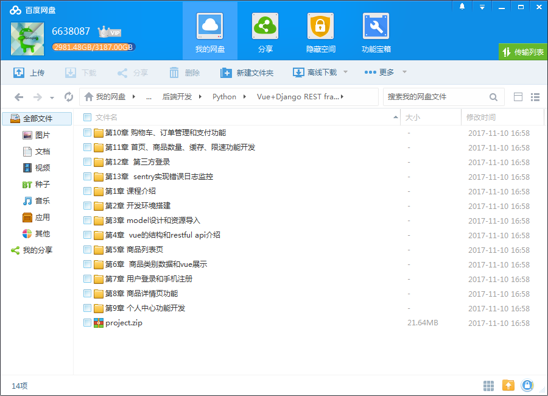
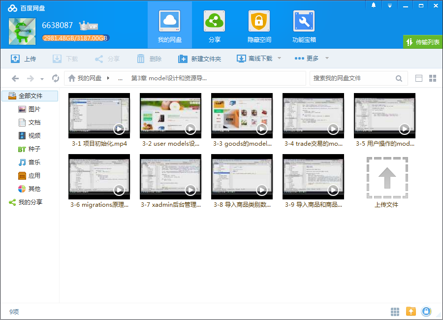
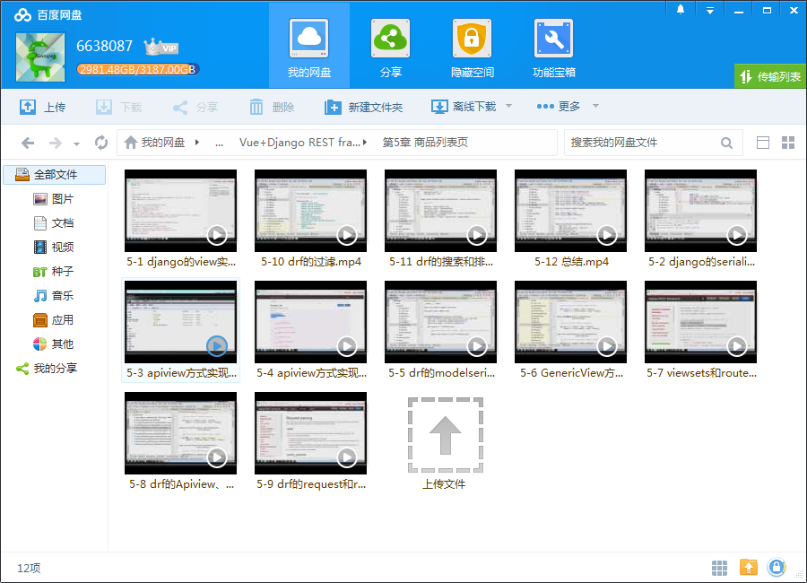

# Vue+Django REST framework 打造生鲜电商项目

## 课程介绍

采用当前流行的前后端分离式开发技术，涉及RESTFul API基础知识和Vue项目结构分析，解决了技术开发单一的痛点，拥有超前的技术融合技能，让你在开发的领域比别人技高一筹！

## 课程章节

### 第1章 课程介绍

介绍课程目标、通过课程能学习到的内容、和系统开发前需要具备的知识

### 第2章 开发环境搭建

介绍系统开发所需的开发环境的搭建， 包括前后端开发所需要的IDE、 mysql、navicat、nodejs、cnpm的配置等， 还介绍了如何配置python虚拟环境

### 第3章 model设计和资源导入

本章节分为项目初始化、model设计和数据导入三部分。 章节详细的讲解了如何初始化项目、分析业务需求之后设计django的app、然后设计好各个app的model，然后介绍如何配置已经写好的xadmin后台管理系统、以及如何去单独使用django的model去从原始文件导入初始化商品数据。...

### 第4章 vue的结构和restful api介绍

本章介绍了一些基础概念，包括restfulapi以及vue前端项目中的一些概念， 以及vue前端项目的组织结构介绍。了解这些概念会让大家在后续的章节中遇到对应的名词时候不会感觉到陌生

### 第5章 商品列表页

本章非常详细的介绍了如何从django开始一步步深入到drf去完成商品的列表页功能， 本章节是课程最重要的一章。也是drf学习的基础。本章节从列表页的功能作为突破点去介绍drf的最重要的一些概念，如apiview， viewsets，router，serializer、分页、过滤等功能， 通过这些知识会让大家对drf有一个整体的概念。 ...

### 第6章 商品类别数据和vue展示

本章节实现了商品分类数据的获取以及商品的搜索功能，本章节不仅实现商品分类列表数据的获取还包括分类详情的获取，在获取到数据后和vue前端项目完成了联调， 也简单介绍了vue项目中是如何完成商品分类数据的显示。

### 第7章 用户登录和手机注册

本章节完成了drf的登录和手机注册功能，首先从drf的token登录原理和实现讲起，然后引申出jwt的登录方式，在详细的讲解了jwt的原理之后我们会讲解如何将jwt登录集成到drf中。在手机注册的功能开发中我们详细的讲解了如何集成云片网到短信发送功能以及如何去完成短信的验证功能，本章节还会详细的讲解serializer的字段验证功...

### 第8章 商品详情页功能

本章节详细的讲解商品详情页功能的开发，包括商品的详情的展示、商品的收藏功能和热卖商品的接口开发，在收藏功能中会介绍到drf的权限以及认证配置

### 第9章 个人中心功能开发

本章节介绍个人中心功能的开发，如个人信息修改、用户收藏管理、留言管理、收货地址的管理和订单管理等。本章还会介绍drf的文档相关功能， 让大家体验到drf的文档自动化管理功能。本章节会更进一步介绍drf的权限、认证配置功能， 也会讲解到动态设置serializer、权限和认证等功能...

### 第10章 购物车、订单管理和支付功能

本章节讲解系统的购物车、订单管理和支付宝支付的功能， 本章节除了讲解功能之外也会带领大家去完成服务器远程代码调试的功能， 支付宝的支付功能我会通过结合支付宝官方文档的方式来讲解支付宝支付的原理以及全流程， 这些知识点让大家不仅能够完成支付宝的支付功能还能理解到支付宝的支付的完整过程，让大家即使用其他...

### 第11章 首页、商品数量、缓存、限速功能开发

第十一章本章节除了完成系统的一些剩余细节之外还能了解到drf的缓存机制以及限制api访问频率的功能。本章节我们会通过django的信号量方式实现商品数量的修改、本章节会讲解api限速的原理。

### 第12章 第三方登录

本章节完成系统的第三方登录集成功能，章节从oauth2.0的原理开始，带领大家去自动实现微博的登录过程之后再代理大家去集成第三方登录的开源项目， 让大家不仅可以轻松集成微博、qq和微信登录以外还能去轻松集成自己想要集成的其他第三方登录...

### 第13章 sentry实现错误日志监控

本章节首先带领大家去体验sentry的错误日志管理功能，让大家领略到sentry的错误日志记录还能及时接收到邮件通知，然后带领大家通过docker去搭建一个自己的错误日志管理系统，最后讲解如何将sentry集成到drf中。

## 更多教程

教程不断整理更新中，以上截图仅供参考，如需了解更多视频教程的详细信息请到如下地址查看：

[教程分类说明](https://itvedios.github.io/categories/)：<https://itvedios.github.io/categories/>

## 获取方式

[关于教程、获取方式、温馨提示](https://itvedios.github.io/about/)
