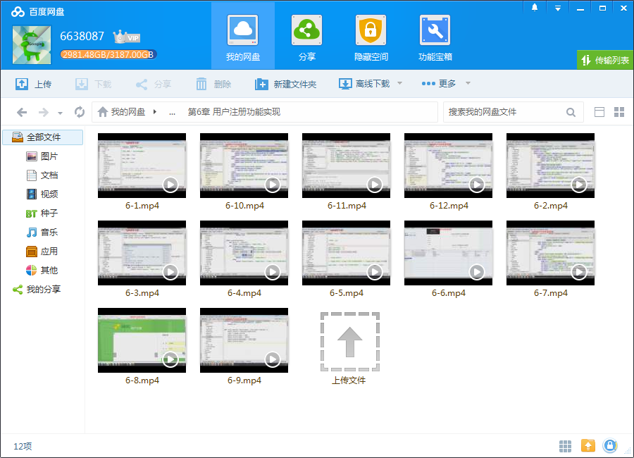
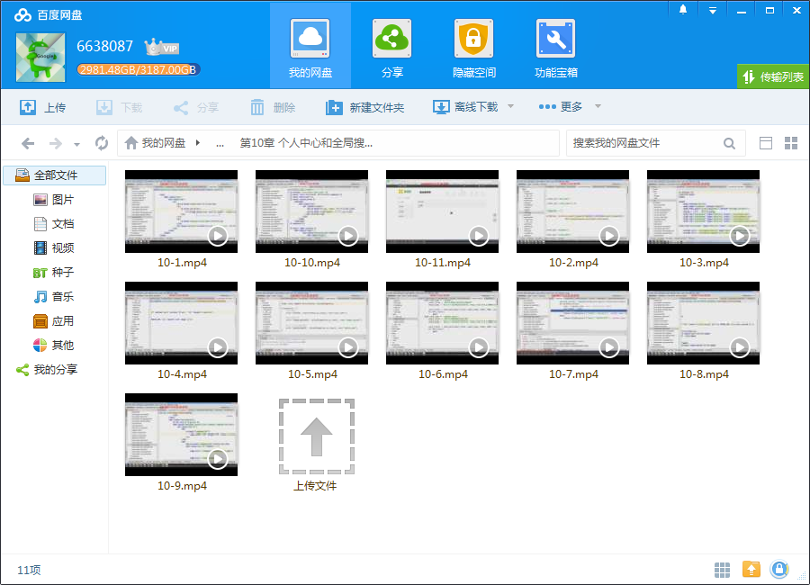

# Python升级3.6 强力Django+杀手级Xadmin打造在线教育平台

## 课程介绍

25小时Django综合实战，从0打造一个模块完整、功能完善、达到上线标准的在线教育平台，全面掌握Django的同时，得到一套完整的代码。

<!--more-->

## 课程章节

### 第1章 课程介绍

介绍课程目标、通过课程能学习到的内容、和系统开发前需要具备的知识

### 第2章 windows下搭建开发环境

介绍项目开发需要安装的开发软件、 python虚拟virtualenv和 virtualenvwrapper的安装和使用、 最后介绍pycharm和navicat的简单使用

### 第3章 通过留言版功能回顾django基础知识

通过django简单实现一个留言板功能来回顾django的基础知识， 包括settings的配置、 url配置、 view逻辑、 model设计和templates的显示

### 第4章 需求分析和model设计

对系统进行需求分析， 然后设计出django app， 然后对每个app设计相应的django model数据表。系统共有四个app， users处理用户相关；courses处理课程相关；organization处理课程机构相关；operation处理用户操作相关

### 第5章 通过xadmin快速搭建后台管理系统

通过xadmin结合第4章设计的model快速的搭建一套完整的后台管理系统；本章首先介绍django admin的简单使用， 然后引出xadmin，在安装xadmin之后将model注册到xadmin中， 最后完成xadmin的全局配置

### 第6章 用户注册功能实现

完成用户注册相关的功能， 包括登录、注册、找回密码等功能， 本章会深入session和cookie的机制以及通过django form对表单进行验证。注册和找回密码会通过图片验证码验证以及通过邮箱验证方式完成

### 第7章 课程机构功能实现

完成课程机构的相关功能， 本章会开始django的templates模板继承机制实现模板的重用。 本章包括分页、筛选、收藏等功能， 会讲到如何通过modelform对表单进行验证和保存。

### 第8章 课程功能实现

完成课程相关功能模块开发， 包括课程列表功能实现、课程详情页展示、 课程评论功能和相关课程推荐等功能实现

### 第9章 课程讲师功能实现

实现授课讲师的列表页和详情页讲师信息的展示

### 第10章 个人中心和全局搜索功能实现

个人中心和系统全局功能实现、 全局功能包括全局导航栏功能和全局搜索功能的实现。 个人中心功能包括个人信息的展示和修改、 头像修改、密码修改、邮箱修改。 邮箱修改需要通过邮箱验证才能修改。 用户学习的课程展示、 用户的收藏展示以及删除收藏功能，最后是用户的个人消息展示...

### 第11章 首页、全局功能细节和404以及500页面配置

本章主要完善整站的实现细节， 如修改点击数、收藏数以及登出功能等。 接着实现系统的首页， 最后配置系统的全局404和500页面

### 第12章 常见web攻击及防范

本章介绍最常见的sql注入攻击、 xss攻击和csrf攻击的原理以及防护

### 第13章 xadmin的进阶开发

介绍xadmin更进阶的开发， 加深对xadmin的理解， 让整个后台管理系统完成更加细节的定制， 包括userprofile的注册、 导航栏icon的修改、 django ueditor富文本编辑器的集成、 xadmin的插件制作。本章会介绍一款excel的导入插件开发

### 第14章 把项目部署上线

本章主要讲解 1. nginx+uwsgi完成线上生成环境的原理 2. mysql的访问权限以及端口绑定配置，以及将本地数据库直接传输到生成环境 3. nginx配置一个虚拟主机，及完成域名和ip地址的转发、 nginx的静态文件代理 4. uwsgi的配置文件的基本配置 5. 代码变更的时候实现uwsgi服务 ...

### 第15章 课程总结

重新梳理一遍系统开发的整个过程， 让同学对系统和开发过程有一个更加直观的理解

### 第16章 快速升级到python3.6+django1.11

简单的配置现有的依赖库和极少量的代码修改直接适配python3.6+django1.11

## 更多教程

教程不断整理更新中，以上截图仅供参考，如需了解更多视频教程的详细信息请到如下地址查看：

[教程分类说明](https://itvedios.github.io/categories/)：<https://itvedios.github.io/categories/>

## 获取方式

[关于教程、获取方式、温馨提示](https://itvedios.github.io/about/)
