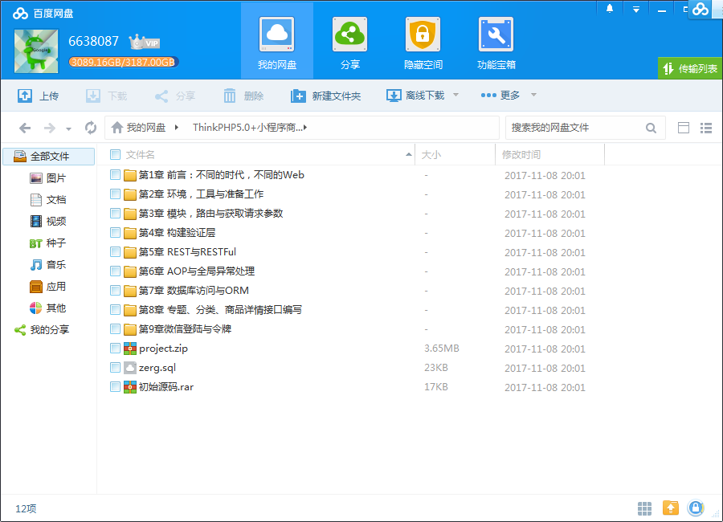
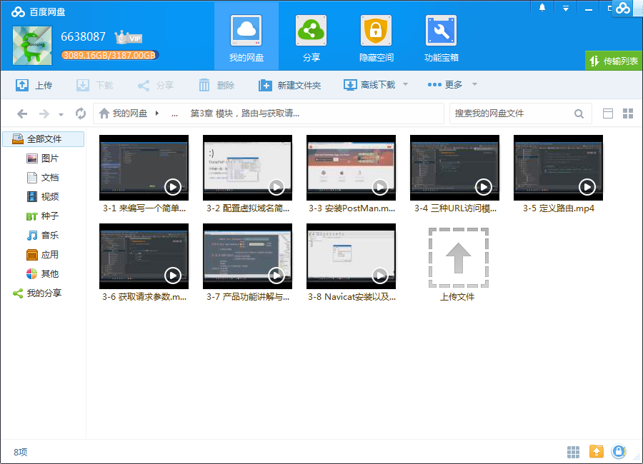
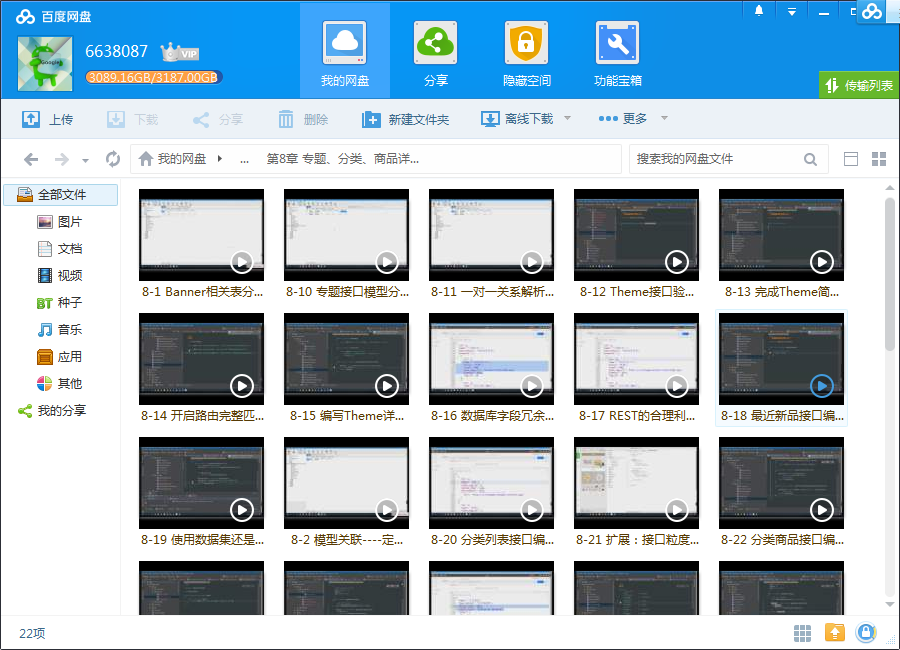

# ThinkPHP 5.0开发微信小程序商场打通全栈项目架构

## 课程介绍

通过开发一个已上线的小程序商城全栈应用，学会如何打造iOS，Android，Web多端适配的服务端标准API，掌握三端分离开发方式，理解现代Web的基本架构思想。

## 课程章节

### 第1章 前言：不同的时代，不同的Web

我们说，做一个产品，真的只是做一个产品吗？恐怕不是。现代的Web产品是一个产品矩阵，需要有良好的服务器端架构来支撑整个产品体系。本小节，我们将对现代Web体系做一个介绍，并对课程所需要学习的知识点有一个初步的了解。...

### 第2章 环境、工具与准备工作

工欲善其事必先利器。我们要做一个全栈项目，那么就必须先将环境搭建好。此小节中，我们将搭建产品开发、运行所需要的必须环境，并对常见工具的使用技巧进行详细的介绍。

### 第3章 模块、路由与获取请求参数

本小节中我们将对TP5的入口文件、三种URL访问模式、虚拟域名配置、路由定义等知识做详细的讲解。

### 第4章 构建验证层

客户端的输入永远是不可信的，我们将在此小节中使用TP5的Validate验证器来构建面向对象的验证层。

### 第5章 REST与RESTFul

REST的流行距今为止已经差不多有10年了。不管你是否选择使用RESTFul API，但至少我们需要了解它。本小节，我们将对REST与RESTFul API的最佳实践做详细的讲解。

### 第6章 AOP与全局异常处理

我们经常在写代码时会遇到异常、抛出异常，处理异常。可异常究竟怎么处理更加合适？异常怎么表示更加标准和规范？本小节，我们将使用TP5的特性和AOP的思想来构建一个全局异常处理层。

### 第7章 数据库访问与ORM

服务器代码很大一部分都是对数据的整理、操作、运算，数据库作为数据的来源必然是整个服务器端的重中之重。我们将在本小节中，详细学习TP5的数据库访问知识以及说明是ORM，如何使用ORM的思想来对数据库进行增删改查。

### 第8章 专题、分类、商品详情接口编写

本小节我们将综合使用之前学习的知识，编写专题、分类和商品等模块的接口，加深对知识的理解。

### 第9章 微信登录与令牌

用户登录、权限分级与接口保护对于API来说是非常重要的。我们将使用微信的身份认证体系来实现免密登陆、使用Token令牌来替代我们传统Web开发中的Cookie进行用户身份验证与权限分级。在有了Token令牌后，我们就可以对用户相关接口：收货地址进行编写了。...

### 第10章 微信支付

微信支付我们经常使用，但我们了解微信支付的整个流程吗？本小节，我们将详细介绍微信支付的整个流程并编写产品的下单、支付与处理支付结果的相关接口。

### 第11章 前端部分：前端框架构建与令牌管理，首页、专题、分类等模块编写

本章我们将开始前端代码的编写。我们在本小节中将介绍前端编码的一些规范并动手实现一些基础框架功能。此外，我们还将编写产品的首页、专题以及分类等模块。

### 第12章 购物车

购物车的操作是整个前端中最为复杂，本章节中我们将实现客户端的购物车功能。

### 第13章 实现微信支付、购买商品流程与用户历史订单

微信支付必须是服务器与客户端一起配合完成的。本章中，我们将来实现商品的完整购买流程。

### 第14章 CMS与CORS跨域

不用开源的CMS管理系统，我们自己动手来编写一个小型的CMS框架，并实现微信模板消息的发送。

### 第15章 小程序部署流程与TP5在生产环境中的优化

本章节将对产品做一个整体的回顾，并讲解小程序从开发到发布再到部署的全部流程以及一些服务器的基本优化措施。

## 更多教程

教程不断整理更新中，以上截图仅供参考，如需了解更多视频教程的详细信息请到如下地址查看：

[教程分类说明](https://itvedios.github.io/categories/)：<https://itvedios.github.io/categories/>

## 获取方式

[关于教程、获取方式、温馨提示](https://itvedios.github.io/about/)
