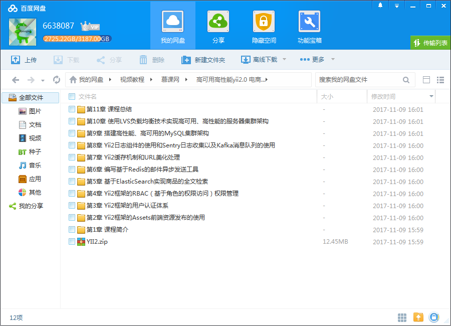
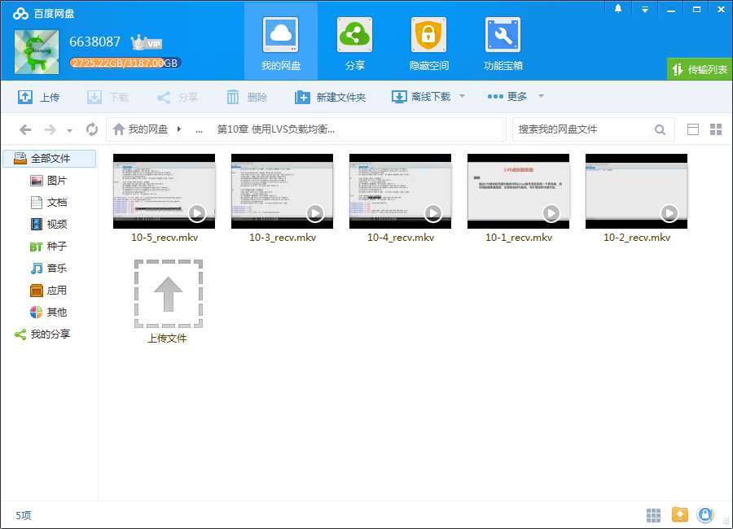
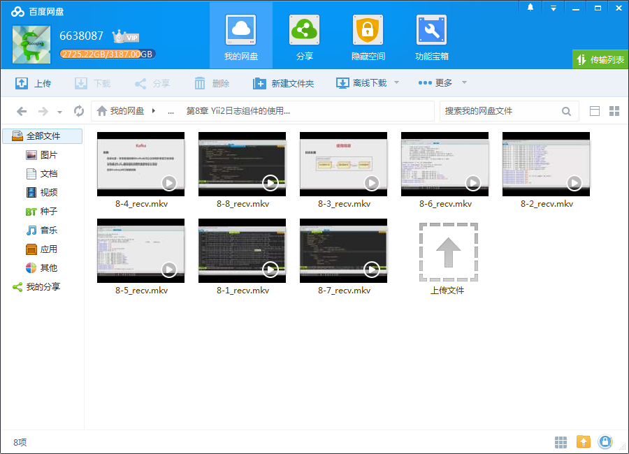
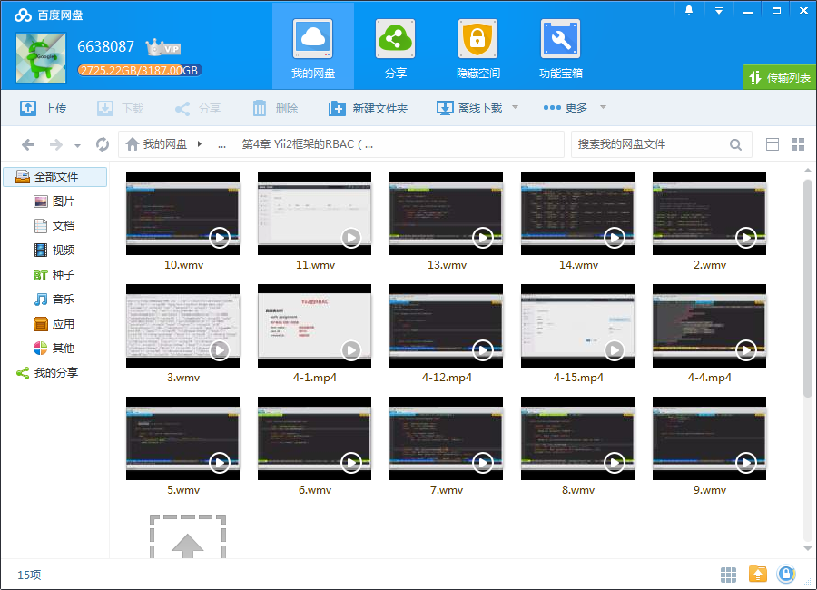

# Yii 2.0进阶版 高级组件 ES/Redis/ Sentry 优化京东平台

## 课程介绍

360高级工程师亲授，遵循一线互联网公司的实际开发流程，从更高级的层面，带你掌握项目功能设计优化、架构设计优化等更高级的技术，深入浅出地讲解实际开发难题和项目优化解决方案，点击视频，立即免费试学。

<!--more-->

## 课程章节

### 第1章 课程简介

本章内容会给大家通览本门课程的所有知识点。

### 第2章 Yii2框架的Assets前端资源发布的使用

本章我们会详细学习Assets组件的使用，使用Nav插件和Breadcrumbs插件进行导航的加载，轻松安装加载第三方组件JSTree完成无限分类的树形展示，如何设置前端资源文件按需加载和使用压缩后的资源文件加速前端页面的加载

### 第3章 Yii2框架的用户认证体系

本章对Web系统的用户认证体系进行重构，我们将使用Yii2框架的用户认证User组件重新设计用户的登录和退出操作，并使用过滤器进行访问用户的验证和请求方式的过滤，不仅如此，我们还会使用更加安全的哈希算法取代MD5对密码进行加密处理，为我们的系统提供更高的安全性。通过本章的学习，大家将可以使用User组件更轻松安全地...

### 第4章 Yii2框架的RBAC（基于角色的权限访问）权限管理

本章将对后台用户的认证进行更细致的权限分配管理，为大家详细讲解RBAC基于角色的访问控制的工作原理以及如何使用Yii2框架的RBAC组件进行用户角色管理、权限节点的一键批量添加，以及为角色分配权限和为用户分配角色的操作，以及如何添加个性化Rule验证规则做精确到数据的权限认证，最后设置后台菜单智能化显示，隐藏没有权...

### 第5章 基于ElasticSearch实现商品的全文检索

本章会完成商品的全文检索功能，课程将为大家搭建ElasticSearch全文检索引擎服务，通过ElaticSearch为我们提供的RESTful_API创建索引以及完成全文数据的检索和关键字的高亮处理。

### 第6章 编写基于Redis的邮件异步发送工具

本章将使用Redis优化系统的邮件发布系统，首先课程会为大家展示如何编写一个基于Redis的邮件离线发送插件，该插件将改进扩展SwiftMailer组件的邮件发送和接收方式，不仅如此，我们还会将编写好的插件提交至Composer官方库，吸引更多的开发者一起来维护和开发我们的插件。通过本章内容的学习，大家可以学习到Redis队列的使用...

### 第7章 Yii2缓存机制和URL美化处理

本章会对系统进行数据缓存、SQL查询缓存，此外，课程还会在缓存的基础上设置缓存依赖，最后我们将开启Session自定义存储至Redis以及使用UrlManager组件进行URL路由的美化，更利于系统的SEO。通过本章内容的学习，大家会掌握绝大多数Web系统的缓存设置方式以及URL美化方式。...

### 第8章 Yii2日志组件的使用和Sentry日志收集以及Kafka消息队列的使用

日志对一个系统的安全和开发运营的重要性是不言而喻的，本章将为大家带来Web日志的分类和处理方式，首先课程会为大家讲解Yii2框架的日志组件的使用，其次将讲解到如何使用Sentry进行错误日志的收集和开发人员处理错误的管理，最后为了提高系统日常运行日志的收集效率而不影响正常业务的运行，将使用Kafka消息队列进行日志的...

### 第9章 搭建高性能、高可用的MySQL集群架构

本章着重对MySQL架构进行优化设计，课程将搭建高性能高可用的MySQL架构，包括MySQL的主从复制、双主热备的实现，以及使用数据库中间件MyCAT进行MySQL数据的读写分离、心跳检测和数据表水平分片分库处理。 通过本章内容的学习，大家可以深入理解如何在大并发、大流量场景下搭建高可用、高性能的MySQL集群架构。...

### 第10章 使用LVS负载均衡技术实现高可用、高性能的服务器集群架构

本章内容将使用LVS负载均衡技术实现高可用、高性能的服务器集群架构，其中课程会讲解LVS负载均衡技术的NAT模式、DR模式以及IP-TUNNELING模式的工作原理及实现方式。

### 第11章 课程总结

本章节针对本课程的所有内容，做下整体的梳理和回顾。

## 更多教程

教程不断整理更新中，以上截图仅供参考，如需了解更多视频教程的详细信息请到如下地址查看：

[教程分类说明](https://itvedios.github.io/categories/)：<https://itvedios.github.io/categories/>

## 获取方式

[关于教程、获取方式、温馨提示](https://itvedios.github.io/about/)
