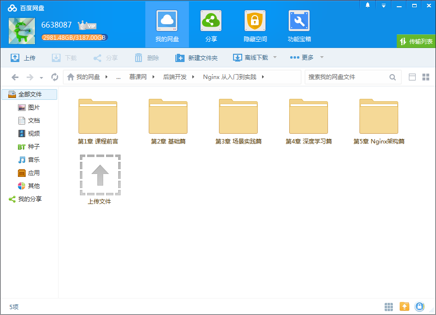
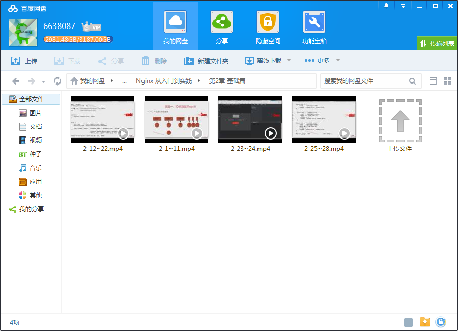
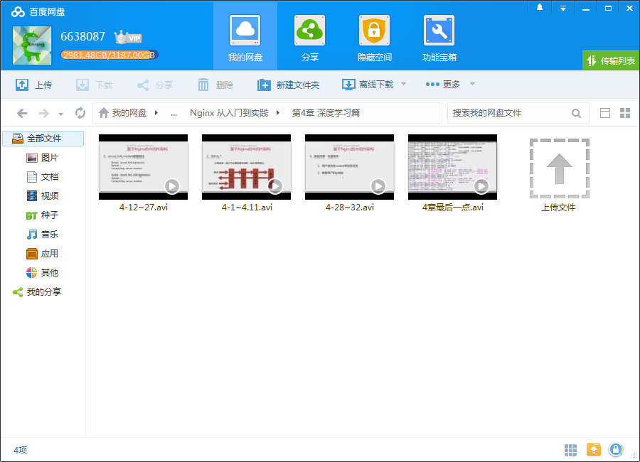

# 企业级刚需Nginx入门，全面掌握Nginx配置+快速搭建高可用架构

## 课程介绍

系统讲解Nginx ，课程通用性非常高，几乎所有与后台相关的技术人员都会用到，了解Nginx 的人很多，但真正掌握Nginx 的却很少，系统掌握Nginx配置与快速搭建高可用架构的技术方法，你必将成为企业争抢的高薪人才！

<!--more-->

## 课程章节

### 第1章 课程前言

总览课程，介绍课程学习须知，环境准备，了解课程意义。

### 第2章 基础篇

讲解Nginx的快速部署安装、模块、基础配置语法。Nginx的日志输出、Nginx默认配置模块。Nginx对于请求的处理，访问控制模块使用，并区别介绍连接限制与请求限制。

### 第3章 场景实践篇

Nginx作为静态资源web服务的场景应用，Nginx做为http代理服务,介绍代理服务的类型，正向反向代理配置，重点讲解nginx作为的应用层负载均衡服务的各种应用，hash负载均衡策略,Nginx缓存等

### 第4章 深度学习篇

Nginx常用配置模块,rewirte的配置语法和规则，配置基于指定地域的规则访问,geoip模块、https的实现原理，配置nginx的https服务,secure_link_module的防盗链实现，讲解，讲解Lua的开发语法、配合Nginx实现高效的认证系统和其他场景。

### 第5章 Nginx架构篇

Nginx常见问题和排错经验，实践应用场景中的方法处理Nginx安全，常见的应用层安全隐患，复杂访问控制，Nignx的sql防注入安全策略,Nginx的整体配置，搭建合理Nginx中间件架构配置步骤、策略Nginx性能优化:架构优化，操作系统优化、Nginx优化等...

## 更多教程

教程不断整理更新中，以上截图仅供参考，如需了解更多视频教程的详细信息请到如下地址查看：

[教程分类说明](https://itvedios.github.io/categories/)：<https://itvedios.github.io/categories/>

## 获取方式

[关于教程、获取方式、温馨提示](https://itvedios.github.io/about/)
