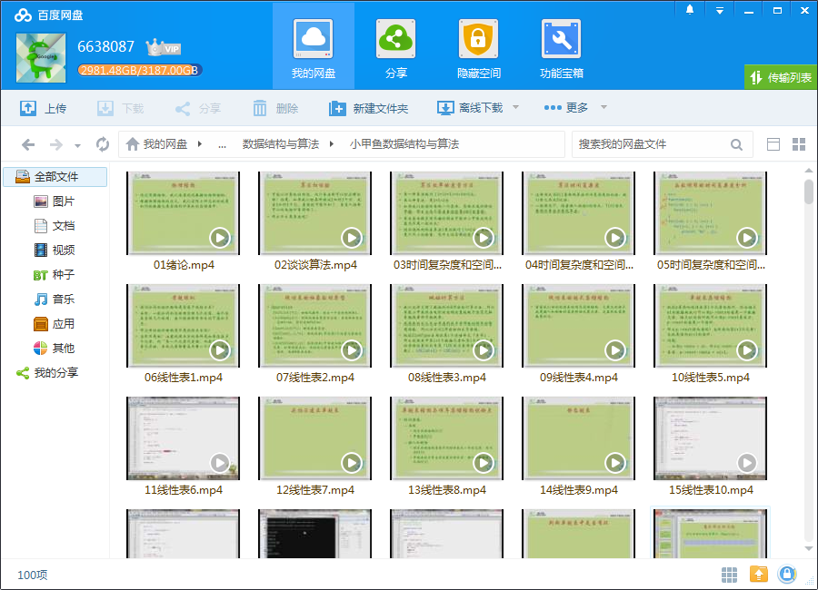
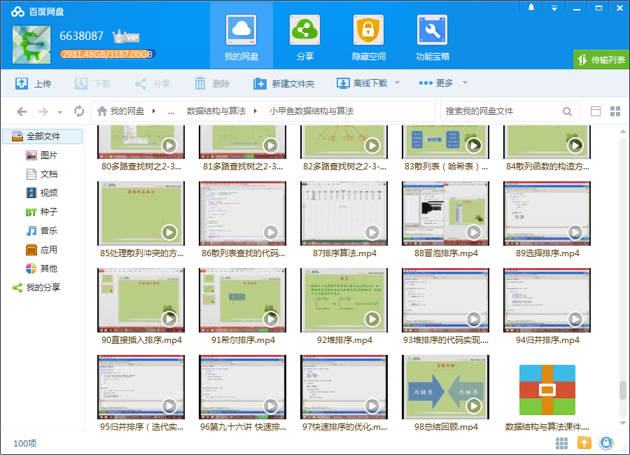

# 小甲鱼数据结构与算法

## 课程介绍

本人看过，感觉蛮好，与一般的大学视频有较大的区别，非常通俗易懂！数据结构和算法这门计算机必修课历来无论在哪个学校，都是无比乏味和催人入睡的。但是，小甲鱼决定要投入大量的精力来将这门课程打造成有屎以来最为华丽的，最为欢乐地，最为图文并茂的课程！数据结构和算法这是一门不太容易学好的课程，因为这门课程比较搞脑子，所以建议每天只听一集视频，并准备好鸡汤等营养品。虽然这门课程不太好学，但如果你想让自己的编程能力有质的飞跃，不再停留于调用现成的东西而是追求更完美的实现，那么这是你的必修课！

## 更多教程

教程不断整理更新中，以上截图仅供参考，如需了解更多视频教程的详细信息请到如下地址查看：
[教程分类说明](https://itvedios.github.io/categories/)：<https://itvedios.github.io/categories/>

## 获取方式

[关于教程、获取方式、温馨提示](https://itvedios.github.io/about/)
