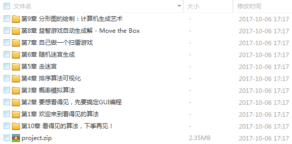
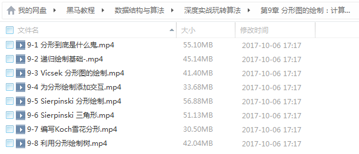
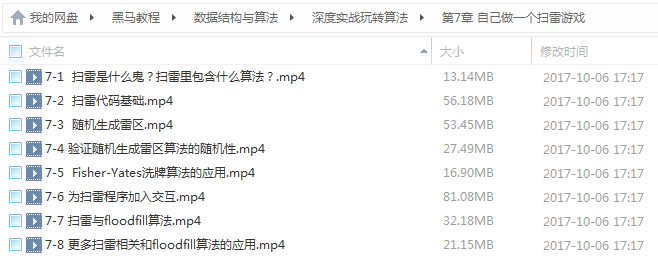
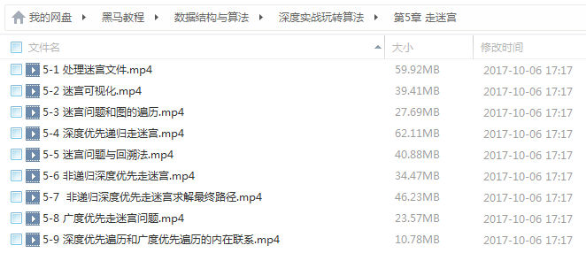

# 看得见的算法 7个经典应用诠释算法精髓

## 深度实战玩转算法

采用基础的Java语言，通过7款经典好玩的游戏，bobo老师带你进入不一样的算法世界，体验算法在实际开发中的应用，真正把算法用起来！

<!--more-->

## 课程章节

### 第1章 欢迎来到看得见的算法

欢迎来到看得见的算法。这个课程将以独一无二的方式，向你展示算法究竟有什么用，在实际项目中能做什么，并向你一一展示通过学习这个课程，你将能够制作出多么酷炫的程序。

### 第2章 要想看得见，先要搞定GUI编程

在这一章，你将从0开始接触Java Swing编程，进入GUI的编程世界。通过这一章的学习，你将了解Java Swing最基本的用法。在这一章的最后，你将能够使用Java Swing制作简单额动画，并且能够使用键盘鼠标进行交互。

### 第3章 概率模拟算法

什么是蒙特卡洛算法？如果一个房间有100个人，每一时刻所有人都随机给另外的人一块钱，一定时间以后，房间里人们的财富分配是怎样的？怎么求解PI的近似值？著名的三门问题是怎么回事？游戏里的宝箱，有20%的中奖率，打开5个宝箱就一定能中奖吗？对于这些问题，在这一章将统统给你答案！...

### 第4章 排序算法可视化

有没有见过网上酷炫的排序过程动画？在这一章，我们将带领你制作选择排序，插入排序，归并排序，快速排序和堆排序的动画。通过这些动画，我们将更深入的理解这些排序算法的优劣，以及相应的优化思路：）

### 第5章 走迷宫

走迷宫是一个经典问题。这一章将针对这个经典问题进行详细分析，最终完成一个可视化的计算机自动在迷宫中寻找正确路径的动画应用。通过这个动画的制作，我们还将深入分析深度优先遍历和广度优先遍历，发现这二者之间最为重要的联系。...

### 第6章 随机迷宫生成

RPG游戏中的迷宫都是如何随机生成的？在这一章，我们将探索一种随机迷宫的生成算法，并且完成一个从无到获得完整酷炫迷宫的动画过程。通过学习这个算法，我们也将领悟，如何在深入理解经典算法的基础上，改进算法，制作个性化的数据结构，来完成不一样的目标。 ...

### 第7章 自己做一个扫雷游戏

虽然游戏引擎越来越发达，但并非所有的游戏都能够通过拖拖拽拽来完成。扫雷就是一个例子。通过这章的学习，我们将探索制作扫雷这个游戏背后的算法，让大家认识到算法无处不在。即使是一个简单的扫雷，如果不会算法，还真实现不出来呢：）...

### 第8章 益智游戏自动生成解 - Move the Box

喜欢益智游戏，但是脑细胞不够用？让我们编程来自动求解一个益智游戏吧！通过这个过程，我们也将初步接触经典人工智能的核心思想——搜索。希望学完了本章课程，你不仅能够学会自动求解Move the Box这个游戏，还能够自己写出求解其他益智游戏的自动化算法。分分钟掌握黑科技！...

### 第9章 分形图的绘制：计算机生成艺术

计算机算法不仅仅可以用于计算求解，还可以用于艺术领域！分形艺术便是其中之一。在这一章中，我们将学习形形色色的分形图的绘制方法，用代码生成绚丽的图案，帮助你实现艺术家的梦想！

### 第10章 看得见的算法，下季再见！

准备这个选题的时候，我列出了可以讲解的20余种应用，之后挑选了难度适中且具有代表性的7个形成了现在的课程。算法的用处其实还多着呢。如果大家喜欢，我将继续为大家奉献：看得见的算法，第二季！

## 更多教程

教程不断整理更新中，以上截图仅供参考，如需了解更多视频教程的详细信息请到如下地址查看：
[教程分类说明](https://itvedios.github.io/categories/)：<https://itvedios.github.io/categories/>

## 获取方式

[关于教程、获取方式、温馨提示](https://itvedios.github.io/about/)
