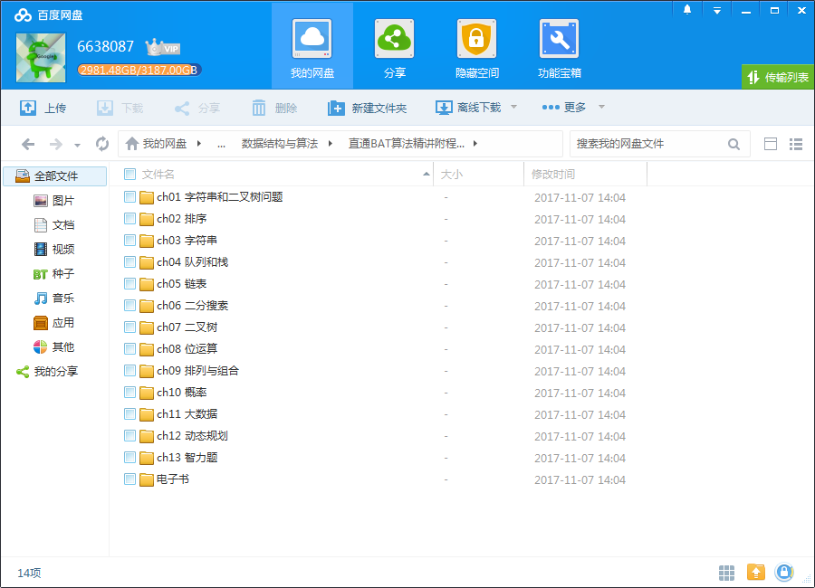
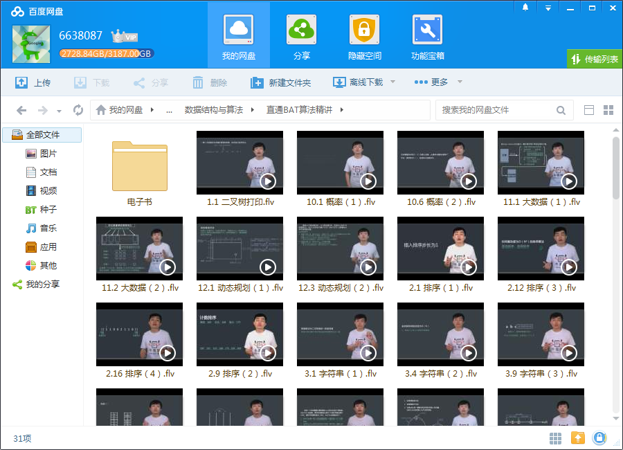
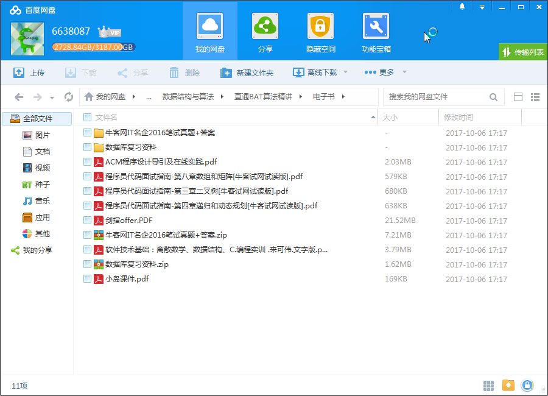

# 直通BAT面试算法精讲课

## 课程简介

程序员找工作必备——必须掌握的算法面试技巧精讲课，适合所有技术求职人员，尤其是算法、数据结构较为薄弱的同学。课程精选十二章算法常考知识点，每章均配套近年名企考题练习，知识点分门别类，讲解深入浅出，使学习更系统、理解更容易、掌握更牢固。

<!--more-->

## 课程内容

### 第一节 排序

排序详细介绍了常见的排序算法过程，以及各个排序算法的稳定性、时间和空间复杂度，当然还有常见面试题目的讲解。

### 第二节 字符串

字符串详细讲述了字符串面试题目的题目特点，常见类型以及常见的字符串面试题。

### 第三节 队列和栈

队列和栈详细讲述了队列、栈和双端队列结构的介绍，宽度优先遍历与深度优先遍历的介绍，以及常见的代码面试题目。

### 第四节 链表

链表详细讲述了链表问题的高分的关键点以及链表有关的常见面试题目。

### 第五节 二分搜索

二分搜索详细讲解了二分搜索的应用范围，二分搜索的注意事项以及与二分搜索相关的面试题目。

### 第六节 二叉树

二叉树详细讲述了二叉树，包括递归二叉树和非递归二叉树的序列打印等高频面试题目。

### 第七节 位运算

位运算介绍了布隆过滤器的基本内容，常见位运算的题目的分析以及高频面试题目。

### 第八节 排列组合

排列组合介绍了笔试面试中有关排列组合常见问题的考察点。

### 第九节 概率

概率讲述了概率相关的知识点以及高频笔试面试题目。

### 第十节 大数据

大数据介绍哈希函数的内容、map###reduce的基本知识、常见海量数据题目分析、大数据题目的常规技巧。

### 第十一节 动态规划

动态规划介绍了动态规划以及相关知识点的高频笔试面试题目。

### 第十二节 智力题

讲解了一些博弈性质的智力题目，包括涂色，赛马，跳格子等。

## 讲师介绍

左程云，华中科技大学（本科）、 芝加哥大学（硕士），曾就职于IBM、百度。 从2010年起专注刷题至今。《程序员代码面试指南—IT名企算法与数据结构题目最优解》 作者，已经由电子工业出版社出版发行。书籍涉及算法与数据结构编程题目近200道，并且提供最优解全部讲解和代码。

## 更多教程

教程不断整理更新中，以上截图仅供参考，如需了解更多视频教程的详细信息请到如下地址查看：
[教程分类说明](https://itvedios.github.io/categories/)：<https://itvedios.github.io/categories/>

## 获取方式

[关于教程、获取方式、温馨提示](https://itvedios.github.io/about/)
